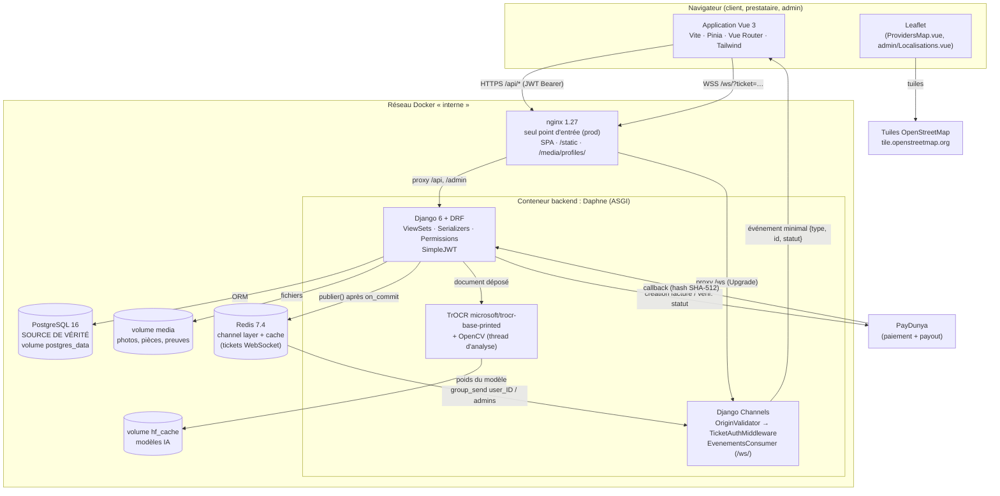

# 01 — Vue d'ensemble

MIMOSY est une plateforme sénégalaise qui met en relation des **clients** et des
**prestataires de services** (plomberie, électricité, ménage…). Trois rôles
existent dans le code (`apps/accounts/models.py`, `User.Role`) :

| Rôle | Ce qu'il fait dans MIMOSY |
|---|---|
| `CLIENT` | cherche un prestataire (liste, carte, recherche intelligente, diagnostic), envoie une demande de prestation ou de devis, prend rendez-vous, paie, laisse un avis, ouvre un litige, signale |
| `PRESTATAIRE` | complète son profil, publie ses services et tarifs, fait vérifier son identité, accepte/refuse/termine les demandes, répond aux devis, gère ses disponibilités et rendez-vous, consulte son wallet et demande des retraits |
| `ADMIN` | valide les pièces d'identité, modère avis et signalements, arbitre les litiges, consulte tableaux de bord, utilisateurs, paiements, localisations |

Un administrateur ne peut **pas** être créé par l'inscription publique
(`validate_role` du serializer d'inscription) ; `is_admin_user()`
(`apps/common/permissions.py`) reconnaît un admin par `is_superuser` **ou** `role == ADMIN`.

Technologies réellement utilisées :

| Côté | Technologies (versions du code) |
|---|---|
| Backend | Python 3.12, Django 6, Django REST Framework, SimpleJWT (+ `token_blacklist`), drf-spectacular (`/api/docs/`), django-cors-headers |
| Temps réel | Django Channels 4.3, Daphne 4.2 (serveur ASGI), channels_redis 4.3 |
| Données | PostgreSQL 16 (source de vérité), Redis 7.4 (événements + cache, sans persistance) |
| IA | TrOCR `microsoft/trocr-base-printed` + OpenCV (pièces d'identité) ; modèles d'avis facultatifs `oliviercaron/fr-camembert-spplus-sentiment` et `gravitee-io/bert-small-toxicity` |
| Paiement | PayDunya (ou fournisseur `sandbox` en développement) |
| Frontend | Vue 3.5, Vite 8, Pinia, Vue Router 5, Tailwind CSS 4, Leaflet 1.9, Chart.js, lucide-vue-next |
| Déploiement | Docker Compose (db, redis, migrate, backend, frontend/nginx) |

### Comment l'expliquer à l'oral ?

> « MIMOSY est une marketplace de services à trois rôles. Le frontend Vue parle à
> une API REST Django ; PostgreSQL garde toutes les données ; Channels et Redis
> préviennent les navigateurs en temps réel quand quelque chose change ; TrOCR
> aide l'administrateur à vérifier les pièces d'identité ; PayDunya encaisse les
> paiements, que MIMOSY bloque jusqu'à la fin de la prestation. »

---

# 02 — Architecture globale

Code Mermaid : [`diagrammes/architecture.mmd`](diagrammes/architecture.mmd).

Les cinq chemins demandés, tels qu'ils existent dans le code :

| Chemin | Ce qui se passe réellement | Fichiers |
|---|---|---|
| **Vue → Nginx → Django/DRF → PostgreSQL** | `services/*.js` appellent `apiFetch` (`services/api.js`, adresse dans `config/api.js`) avec `Authorization: Bearer <access>` ; nginx relaie `/api` à Daphne ; le routeur DRF choisit un ViewSet ; le serializer valide ; l'ORM écrit dans PostgreSQL | `mimosy/src/services/api.js`, `mimosy/docker/nginx.conf`, `config/urls.py`, `apps/*/views.py` |
| **Django → Channels → Redis → WebSocket → Frontend** | un signal `post_save` appelle `evenements.publier()`, qui attend la fin de la transaction (`transaction.on_commit`) puis fait `group_send` dans Redis ; le consumer du destinataire pousse `{type, id, statut}` ; le navigateur recharge le détail par REST | `apps/realtime/signaux.py`, `evenements.py`, `consumers.py`, `mimosy/src/services/realtime.js` |
| **Django → TrOCR** | le dépôt d'une pièce renvoie 202 et lance un thread qui détecte la carte (OpenCV), découpe les lignes et lit chaque ligne avec TrOCR | `apps/verification/views.py`, `services.py` |
| **Django → PayDunya** | `initier_paiement` crée le `Payment` puis appelle le fournisseur choisi par `PAYMENT_PROVIDER` ; PayDunya rappelle `/api/wallet/webhooks/paydunya/` | `apps/wallet/services.py`, `providers/paydunya.py`, `paydunya_client.py` |
| **Frontend → Leaflet / OpenStreetMap** | Leaflet affiche des tuiles `tile.openstreetmap.org` ; les distances viennent du backend (`distance_km`, formule de Haversine en SQL) | `mimosy/src/components/**/ProvidersMap.vue`, `views/admin/Localisations.vue`, `apps/services/views.py` |

Principe clé : **REST = actions, WebSocket = notifications**. Le WebSocket ne
transporte jamais de donnée métier complète ; il dit « quelque chose a changé »,
et le navigateur relit par l'API REST, qui applique les permissions.

### Comment l'expliquer à l'oral ?

> « Tout passe par une seule porte, nginx. Les actions (créer, accepter, payer)
> sont des requêtes REST. Quand une action modifie la base, Django publie un petit
> événement dans Redis ; Channels le pousse au bon navigateur, qui recharge les
> données. PostgreSQL reste la seule source de vérité. »

---

# 03 — Architecture en couches

| Couche | Rôle | Fichiers | Classes / fonctions principales | Données manipulées | Dépend de |
|---|---|---|---|---|---|
| **Présentation** (frontend) | afficher, saisir, naviguer | `mimosy/src/views/**`, `components/**`, `router/index.js` | 40 vues, 53 composants, garde `router.beforeEach` | JSON de l'API | services frontend, stores |
| **Accès API frontend** | appeler l'API, gérer le JWT et le temps réel | `src/config/api.js` (adresse + endpoints), `src/services/api.js` (`apiFetch`), `src/services/*.js` (19 dont `api.js`), `src/stores/*.js` (8) | `apiFetch`, rafraîchissement du jeton sur 401, `realtime.js` | jetons (`localStorage`), réponses JSON | backend REST et `/ws/` |
| **Entrée HTTP / WS** | point d'entrée, routage, CORS | `config/urls.py`, `config/asgi.py`, `apps/*/urls.py`, `apps/realtime/routing.py` | `ProtocolTypeRouter`, `OriginValidator`, `TicketAuthMiddleware`, `DefaultRouter` | requêtes | DRF, Channels |
| **Contrôleurs** (vues) | authentifier, autoriser, orchestrer | `apps/*/views.py`, `apps/*/permissions.py`, `apps/common/permissions.py` | 54 classes de vue (ViewSets + APIView), `@action` (accepter, refuser, terminer…) | objets du modèle | serializers, services, modèles |
| **Validation / sérialisation** | valider les entrées, formater les sorties | `apps/*/serializers.py` | 54 serializers | dictionnaires ↔ modèles | modèles |
| **Services métier** | règles qui ne tiennent pas dans une vue | `apps/wallet/services.py`, `apps/disputes/services.py`, `apps/verification/services.py`, `apps/reviews/services.py`, `apps/trust/services.py`, `apps/services/nlp.py`, `apps/services/visibilite.py`, `apps/realtime/evenements.py` | `initier_paiement`, `liberer_fonds_pour_prestation`, `geler_fonds_litige`, `analyser_document`, `calculer_score_confiance` (trust), `interpreter_requete` | modèles, montants, textes | modèles, fournisseurs externes |
| **Domaine / persistance** | structure des données, contraintes | `apps/*/models.py`, `migrations/` | 23 modèles | tables PostgreSQL | ORM Django |
| **Infrastructure** | stockage, messages, fichiers | PostgreSQL, Redis, volumes Docker, PayDunya, Hugging Face | `RedisChannelLayer`, `RedisCache` | lignes, événements, fichiers | Docker |

> Le nom exact de la fonction de score de confiance se lit dans
> [04-applications-reference.md](04-applications-reference.md#appstrust) ; le
> score n'est **jamais stocké** : il est recalculé à chaque demande.

### Scénario d'une requête (Client → API → ViewSet → Serializer → Model → PostgreSQL)

Exemple réel : un client crée une demande de prestation.

1. Le frontend (`services/demandePrestationService.js`) envoie
   `POST /api/demande-prestation/` avec le JWT.
2. `config/urls.py` inclut `apps.prestations.urls` ; le `DefaultRouter` envoie la requête à
   `DemandePrestationViewSet.create`.
3. Les permissions sont évaluées (`IsAuthenticated`, `IsClient` pour la création).
4. `DemandePrestationCreateSerializer` (choisi par `get_serializer_class` pour `create`) valide : compte prestataire actif, `disponibilite=True`,
   `statut_verification == VERIFIE` (`validate_prestataire`), et une offre `PrestataireService`
   disponible pour ce service (`validate`).
5. `perform_create` fait `serializer.save(client=self.request.user)` (jamais la valeur envoyée
   par le navigateur) ; le statut vaut `EN_ATTENTE` par défaut (champ du modèle), et une
   `Notification` est créée pour le prestataire.
6. L'ORM fait l'`INSERT` dans `prestations_demandeprestation`.
7. Le signal `post_save` publie `demande.nouvelle` au prestataire, **après** validation de la transaction.
8. La réponse `201 Created` renvoie la demande sérialisée.

### Comment l'expliquer à l'oral ?

> « Chaque couche a une seule responsabilité : la vue décide qui a le droit, le
> serializer vérifie les données, le service applique les règles d'argent ou
> d'IA, le modèle garantit les contraintes en base. Une règle critique, comme
> "un seul paiement réussi par demande", est même vérifiée par PostgreSQL. »
