# 06-07 — Diagrammes Mermaid

Chaque diagramme existe aussi comme fichier séparé dans `diagrammes/`, à coller
tel quel dans Mermaid Live Editor (https://mermaid.live). Les diagrammes de
classes `classes-complet` et `domaine-*` sont **générés depuis les modèles
Django** ; les autres (architecture, simplifié, séquences) sont écrits à la main
à partir du code, et ne contiennent que des éléments qui y existent.

Lecture des cardinalités (vue depuis la classe qui porte la clé étrangère) :
`A "0..*" --> "1" B : champ` = plusieurs A pointent vers un même B (clé étrangère
obligatoire) ; `"0..1"` côté B = clé étrangère facultative (`null=True`) ;
`--` avec `0..*` des deux côtés = relation ManyToMany.

## `architecture.mmd`

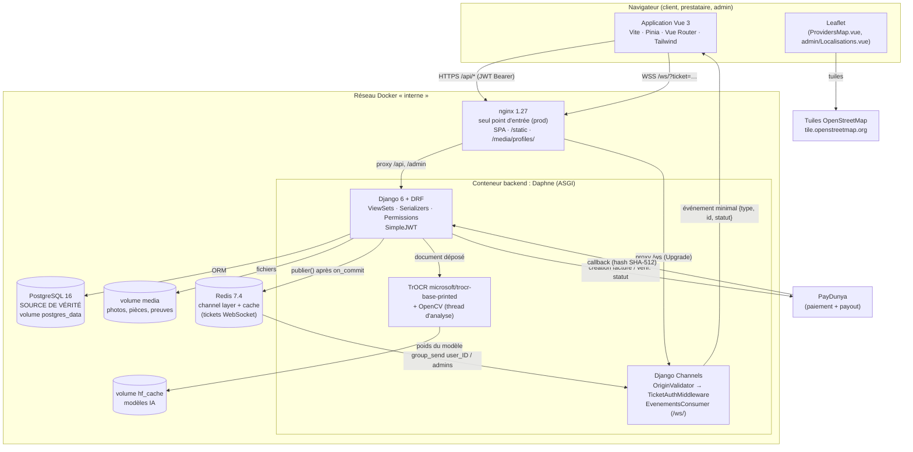

## `classes-simplifie.mmd`

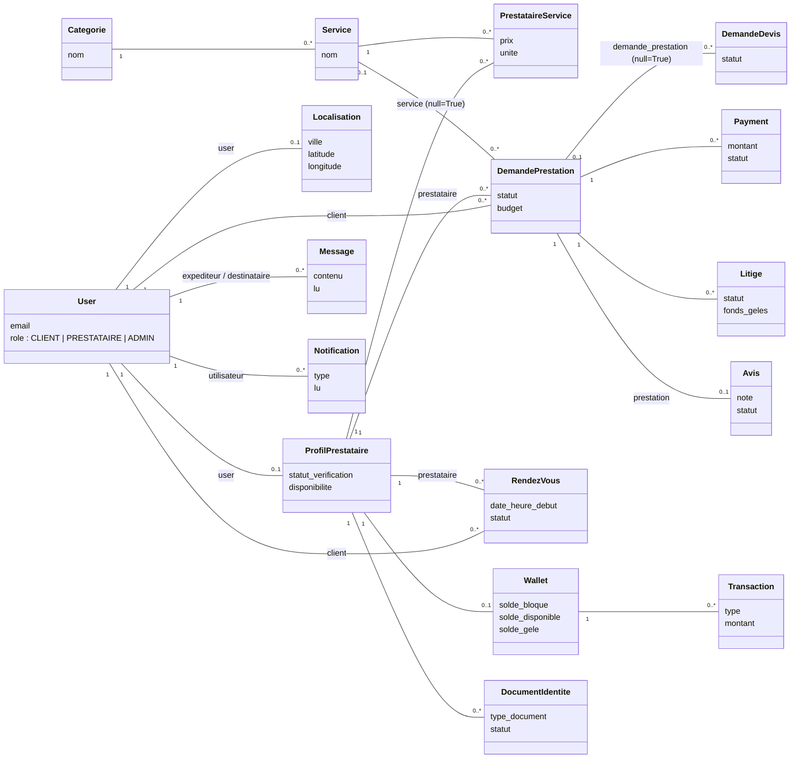

## `classes-complet.mmd`

```mermaid
---
title: MIMOSY — modèles Django (complet, généré depuis le code)
---
classDiagram
    direction LR
    class User {
        <<AUTH_USER_MODEL>>
        +int id
        +str password
        +datetime last_login
        +bool is_superuser
        +bool is_staff
        +bool is_active
        +datetime date_joined
        +str first_name
        +str last_name
        +str username
        +email email
        +str phone
        +file profile_photo
        +str role
    }
    class Localisation {
        +uuid id
        +str adresse
        +str ville
        +str quartier
        +decimal latitude
        +decimal longitude
        +datetime updated_at
    }
    class ProfilPrestataire {
        +uuid id
        +text description
        +date date_naissance
        +int experience
        +bool disponibilite
        +str statut_verification
    }
    class Categorie {
        +uuid id
        +str nom
        +text description
        +str image
        +str statut
        +datetime date_creation
    }
    class Service {
        +uuid id
        +str nom
        +text description
        +datetime date_creation
    }
    class Competence {
        +uuid id
        +str nom
        +text description
    }
    class PrestataireService {
        +uuid id
        +decimal prix
        +str unite
        +text description
        +bool disponible
        +datetime date_creation
    }
    class DemandePrestation {
        +uuid id
        +text description
        +datetime date_souhaitee
        +str statut
        +decimal budget
        +datetime date_creation
    }
    class DemandeDevis {
        +uuid id
        +text description
        +decimal budget_estime
        +datetime date_souhaitee
        +str statut
        +datetime date_creation
    }
    class ReponseDevis {
        +uuid id
        +decimal prix_propose
        +text description
        +int delai_estime
        +str statut
    }
    class Disponibilite {
        +uuid id
        +int jour_semaine
        +time heure_debut
        +time heure_fin
        +bool actif
        +datetime date_creation
    }
    class RendezVous {
        +uuid id
        +datetime date_heure_debut
        +datetime date_heure_fin
        +str statut
        +text notes
        +datetime date_creation
        +datetime date_modification
    }
    class DocumentIdentite {
        +uuid id
        +str type_document
        +file fichier
        +str statut
        +json donnees_extraites
        +json resultat_comparaison
        +float score_correspondance
        +text motif_rejet
        +datetime date_soumission
        +datetime date_analyse_debut
        +datetime date_decision
    }
    class Wallet {
        +uuid id
        +decimal solde_bloque
        +decimal solde_disponible
        +decimal solde_gele
        +str devise
        +str statut
        +datetime date_creation
        +datetime date_modification
    }
    class Transaction {
        +uuid id
        +str type
        +decimal montant
        +uuid reference
        +str description
        +datetime date_creation
    }
    class Payment {
        +uuid id
        +decimal montant
        +str statut
        +str provider
        +str reference_externe
        +str idempotency_key
        +bool fonds_liberes
        +datetime date_creation
        +datetime date_modification
    }
    class Withdrawal {
        +uuid id
        +decimal montant
        +str provider
        +str destination
        +str statut
        +str reference_externe
        +str idempotency_key
        +datetime date_creation
    }
    class Message {
        +uuid id
        +text contenu
        +bool lu
        +datetime date_envoi
    }
    class Notification {
        +uuid id
        +str titre
        +text message
        +str type
        +bool lu
        +datetime date_creation
    }
    class Avis {
        +uuid id
        +int note
        +text commentaire
        +str statut
        +str sentiment
        +float score_sentiment
        +float score_toxicite
        +bool est_inapproprie
        +datetime date_analyse
        +datetime date_creation
    }
    class Signalement {
        +uuid id
        +str motif
        +text description
        +str type_cible
        +str statut
        +datetime date_creation
        +text note_resolution
        +datetime date_traitement
    }
    class Litige {
        +uuid id
        +str motif
        +text description_client
        +text description_prestataire
        +str statut
        +text decision_admin
        +datetime date_creation
        +datetime date_traitement
        +decimal montant_concerne
        +bool fonds_geles
        +datetime date_decision
        +datetime date_limite_reprise
        +datetime date_confirmation_reprise
    }
    class PreuveLitige {
        +uuid id
        +str type_preuve
        +file fichier
        +str description
        +datetime date_ajout
    }
    class AbstractUser {
        <<Django>>
    }
    AbstractUser <|-- User
    Localisation "0..1" --> "1" User : user
    ProfilPrestataire "0..1" --> "1" User : user
    Service "0..*" --> "1" Categorie : categorie
    Competence "0..*" -- "0..*" ProfilPrestataire : prestataires
    PrestataireService "0..*" --> "1" ProfilPrestataire : prestataire
    PrestataireService "0..*" --> "1" Service : service
    PrestataireService "0..*" -- "0..*" Competence : competences
    DemandePrestation "0..*" --> "1" User : client
    DemandePrestation "0..*" --> "1" ProfilPrestataire : prestataire
    DemandePrestation "0..*" --> "0..1" Service : service
    DemandeDevis "0..*" --> "1" User : client
    DemandeDevis "0..*" --> "0..1" DemandePrestation : demande_prestation
    DemandeDevis "0..*" --> "0..1" ProfilPrestataire : prestataire
    DemandeDevis "0..*" --> "0..1" Service : service
    ReponseDevis "0..*" --> "1" DemandeDevis : demande
    ReponseDevis "0..*" --> "1" ProfilPrestataire : prestataire
    Disponibilite "0..*" --> "1" ProfilPrestataire : prestataire
    RendezVous "0..*" --> "1" User : client
    RendezVous "0..*" --> "1" ProfilPrestataire : prestataire
    RendezVous "0..*" --> "1" Service : service
    RendezVous "0..*" --> "0..1" DemandePrestation : demande_prestation
    DocumentIdentite "0..*" --> "1" ProfilPrestataire : prestataire
    DocumentIdentite "0..*" --> "0..1" User : valide_par
    Wallet "0..1" --> "1" ProfilPrestataire : prestataire
    Transaction "0..*" --> "1" Wallet : wallet
    Payment "0..*" --> "1" User : client
    Payment "0..*" --> "1" DemandePrestation : demande_prestation
    Withdrawal "0..*" --> "1" ProfilPrestataire : prestataire
    Withdrawal "0..*" --> "1" Wallet : wallet
    Message "0..*" --> "1" User : expediteur
    Message "0..*" --> "1" User : destinataire
    Notification "0..*" --> "1" User : utilisateur
    Avis "0..*" --> "1" User : auteur
    Avis "0..*" --> "1" ProfilPrestataire : prestataire
    Avis "0..1" --> "1" DemandePrestation : prestation
    Signalement "0..*" --> "1" User : createur
    Signalement "0..*" --> "0..1" User : traite_par
    Litige "0..*" --> "1" DemandePrestation : demande_prestation
    Litige "0..*" --> "1" User : client
    Litige "0..*" --> "1" ProfilPrestataire : prestataire
    Litige "0..*" --> "1" User : ouvert_par
    Litige "0..*" --> "0..1" User : traite_par
    Litige "0..*" --> "0..1" ProfilPrestataire : nouveau_prestataire
    PreuveLitige "0..*" --> "1" Litige : litige
    PreuveLitige "0..*" --> "1" User : deposee_par
```

## `domaine-communication.mmd`

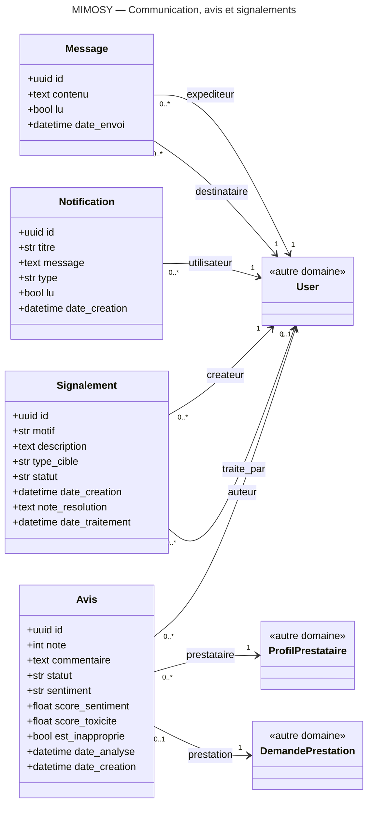

## `domaine-comptes-profils.mmd`

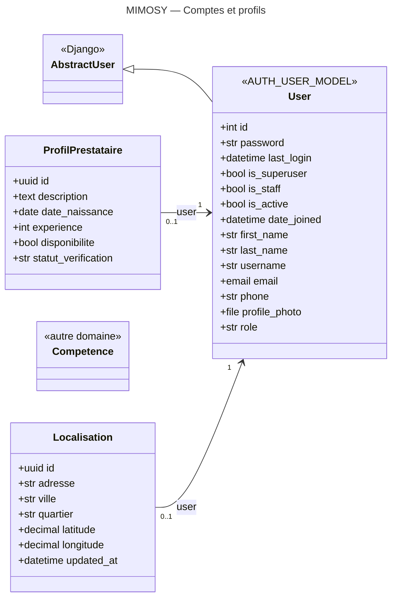

## `domaine-litiges.mmd`

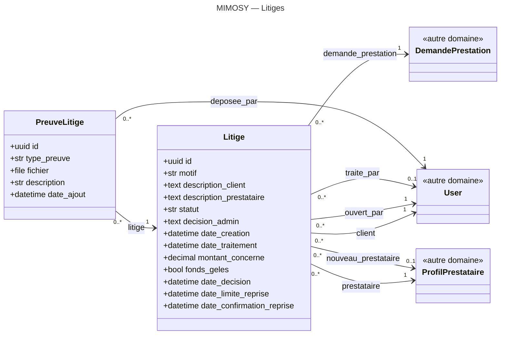

## `domaine-localisation.mmd`

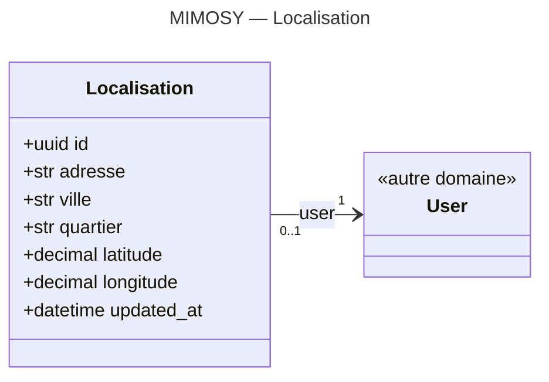

## `domaine-marketplace.mmd`

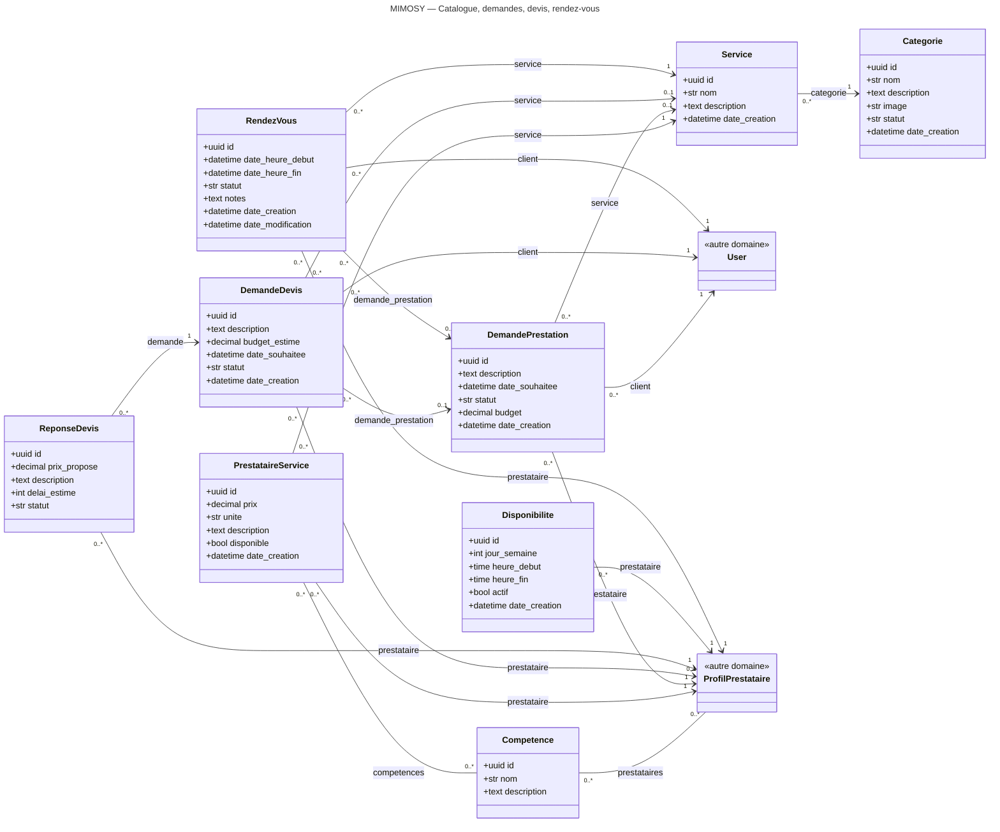

## `domaine-paiement.mmd`

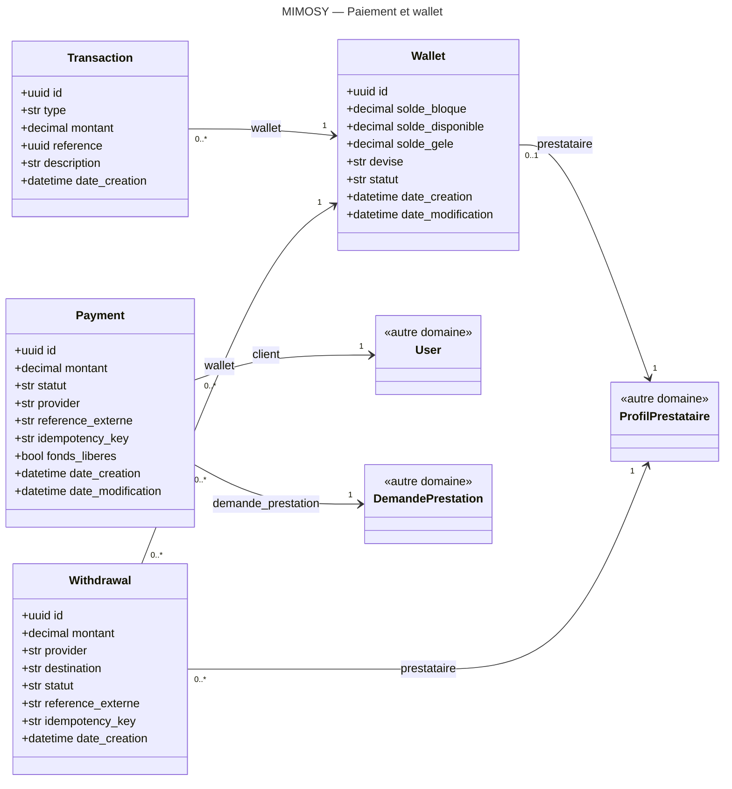

## `domaine-verification.mmd`

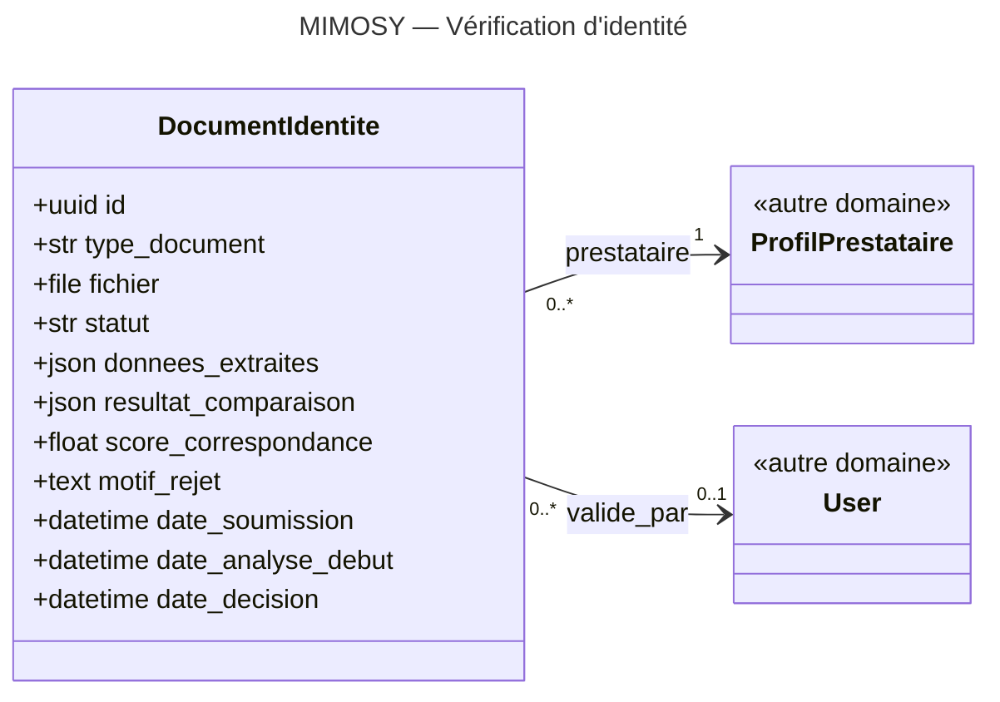

## `sequence-paiement.mmd`

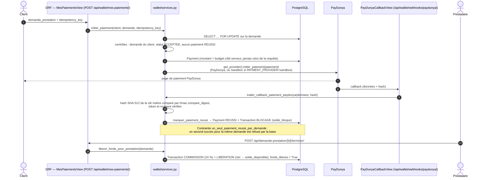

## `sequence-temps-reel.mmd`

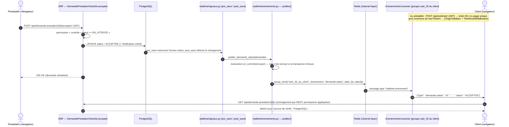

## `sequence-verification.mmd`

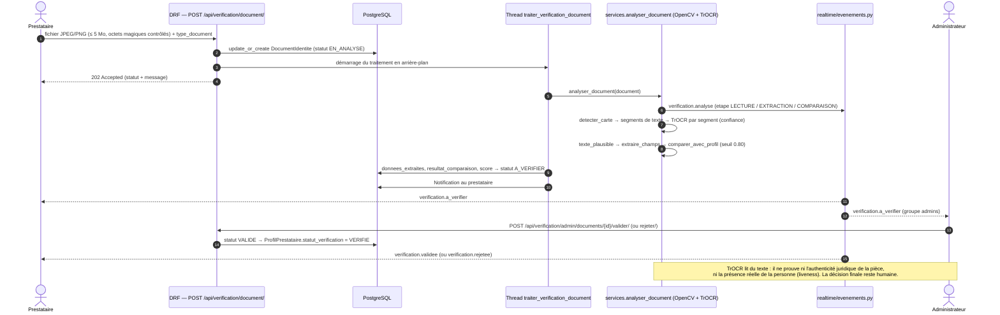
