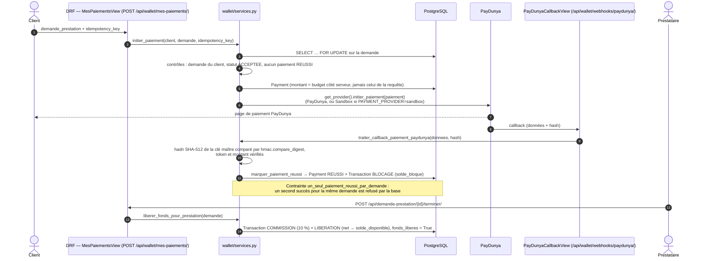

# 15 — Paiement et wallet

Fichiers : `apps/wallet/models.py`, `services.py`, `views.py`, `serializers.py`,
`paydunya_client.py`, `providers/base.py`, `providers/paydunya.py`,
`providers/sandbox.py`. Documents complémentaires : `docs/paiement.md`, `docs/wallet.md`.

## Principe : un séquestre (escrow)

Le client paie **avant** la prestation ; l'argent est **bloqué** sur le wallet du
prestataire (`solde_bloque`) ; il n'est **libéré** (`solde_disponible`) que quand
le prestataire marque la prestation terminée, moins la commission MIMOSY.
En cas de litige, il est **gelé** (`solde_gele`) jusqu'à la décision de l'admin.

| Solde du `Wallet` | Signification | Contrainte en base |
|---|---|---|
| `solde_bloque` | payé par des clients, prestation pas encore terminée | ≥ 0 |
| `solde_disponible` | retirable par le prestataire | ≥ 0 |
| `solde_gele` | bloqué par un litige | ≥ 0 |
| `solde_total` | propriété Python (somme), non stockée | — |

Chaque mouvement laisse une ligne `Transaction` (types : `BLOCAGE`, `COMMISSION`,
`LIBERATION`, `RETRAIT`, `REMBOURSEMENT`, `GEL_LITIGE`, `DEGEL_LITIGE`,
`REATTRIBUTION_LITIGE`). Le solde est donc **explicable ligne par ligne**.

## Fournisseurs de paiement

`PAYMENT_PROVIDER` choisit le fournisseur (`get_provider()`, interface `providers/base.py`) :

| Valeur | Fichier | Comportement |
|---|---|---|
| `sandbox` (défaut) | `providers/sandbox.py` | paiement confirmé immédiatement : pour le développement et les tests |
| `paydunya` | `providers/paydunya.py` + `paydunya_client.py` | crée une facture PayDunya, renvoie `url_paiement` ; le paiement reste `EN_ATTENTE` jusqu'au callback ou à la vérification de statut |

`PAYDUNYA_MODE` vaut `test` par défaut. Clés : `PAYDUNYA_MASTER_KEY`,
`PAYDUNYA_PRIVATE_KEY`, `PAYDUNYA_TOKEN` (secrets, `********`).

## Déroulé réel

Code Mermaid : [`diagrammes/sequence-paiement.mmd`](diagrammes/sequence-paiement.mmd).

## Les points que le jury peut demander

| Sujet | Ce que fait le code | Où |
|---|---|---|
| **Montant** | `montant = demande.budget` lu en base, sous verrou ; la requête ne transmet jamais de montant | `initier_paiement` |
| **Statuts** | `INITIE` (défaut) → `EN_ATTENTE` (PayDunya) → `REUSSI` / `ECHOUE` ; `ANNULE`, `REMBOURSE` existent dans les choix | `Payment.Statut` |
| **Idempotence** | la même `idempotency_key` renvoie le paiement déjà créé (double clic, réseau) ; le frontend génère une nouvelle clé par tentative | `initier_paiement`, `walletService.js` |
| **Un seul succès par demande** | vérification sous `select_for_update()` de la demande **et** `UniqueConstraint(condition=statut REUSSI)` en base | `initier_paiement`, `Payment.Meta` |
| **Webhook** | `POST /api/wallet/webhooks/paydunya/` (`AllowAny`, car appelé par PayDunya) ; 1) hash SHA-512 de la clé maître, comparé en temps constant (`hmac.compare_digest`) ; 2) paiement retrouvé par `custom_data.payment_id` ; 3) token = `reference_externe` ; 4) montant = montant MIMOSY | `traiter_callback_paiement_paydunya`, `PayDunyaClient.verifier_hash` |
| **Callback manqué** | `GET /api/wallet/mes-paiements/<uuid>/statut/` interroge PayDunya (`verifier_statut_paiement`) | `StatutPaiementView` |
| **Double traitement** | `marquer_paiement_reussi` ne fait rien si le paiement est déjà `REUSSI` (callback reçu deux fois) ; `liberer_fonds_pour_prestation` ne traite qu'un paiement `fonds_liberes=False` | `wallet/services.py` |
| **Commission** | `COMMISSION_TAUX` (0.10 par défaut), arrondie au centime (`quantize(Decimal("0.01"))`) | `liberer_fonds_pour_prestation` |
| **Retraits** | `initier_retrait` : solde disponible suffisant, `idempotency_key`, `Transaction RETRAIT` ; échec → solde restauré ; callback payout `/api/wallet/webhooks/paydunya-payout/` | `initier_retrait`, `traiter_callback_payout_paydunya` |
| **Litiges** | `geler_fonds_litige` gèle le montant net si un paiement `REUSSI` existe ; résolution → dégel vers le prestataire ; réattribution → `transferer_fonds_geles` (75 % au nouveau prestataire, `LITIGE_REATTRIBUTION_PART_NOUVEAU`) | `apps/disputes/services.py` |

## Point de vigilance (constat, non corrigé)

Dans `marquer_paiement_reussi`, le test « déjà `REUSSI` ? » est fait **avant**
la transaction et **sans verrou sur le paiement** (seul le wallet est verrouillé).
Si le callback PayDunya et la vérification de statut arrivent **exactement en
même temps** pour le même paiement, les deux pourraient passer le test et bloquer
deux fois le montant. La contrainte `un_seul_paiement_reussi_par_demande` ne
l'empêche pas (c'est la même ligne `Payment`). Risque théorique, **À VÉRIFIER**
par un test de concurrence ; correction proposée dans
[18-audit-et-ameliorations.md](18-audit-et-ameliorations.md) (non appliquée).

### Comment l'expliquer à l'oral ?

> « Le montant ne vient jamais du navigateur, il vient du budget enregistré. Un
> double clic ne crée pas deux paiements grâce à la clé d'idempotence, et la base
> interdit deux paiements réussis pour la même demande. Le callback PayDunya est
> authentifié par un hash comparé en temps constant, puis je revérifie le token
> et le montant. L'argent reste bloqué jusqu'à la fin de la prestation. »
