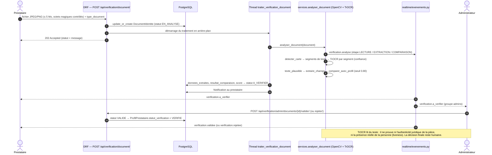

# 16 — Vérification d'identité et TrOCR

Fichiers : `apps/verification/models.py`, `views.py`, `serializers.py`,
`services.py` (≈ 1 150 lignes), `permissions.py`, `apps.py` ;
frontend `views/prestataire/Verification.vue`, `views/admin/Verifications.vue`,
`utils/verification.js`.

## Règle fondamentale

**L'IA ne décide jamais.** Quel que soit le score, l'analyse automatique met le
document au statut `A_VERIFIER`. Seul un administrateur peut passer à `VALIDE`
ou `REJETE` (`DocumentIdentiteAdminViewSet.valider` / `rejeter`), et c'est la
validation qui passe le profil à `statut_verification = VERIFIE`. Un prestataire
non vérifié ne peut pas recevoir de demande (`validate_prestataire`).

## Statuts de `DocumentIdentite`

`NON_SOUMIS` → `EN_ANALYSE` (dépôt) → `A_VERIFIER` (fin d'analyse) → `VALIDE` / `REJETE` (admin).
Types : `PIECE_IDENTITE`, `DIPLOME`, `CERTIFICATION`, `DOCUMENT_PROFESSIONNEL`.
**Seule la `PIECE_IDENTITE` est lue par l'OCR** ; les autres passent directement à `A_VERIFIER`.

## Chaîne de traitement réelle

Code Mermaid : [`diagrammes/sequence-verification.mmd`](diagrammes/sequence-verification.mmd).

| Étape | Fonction (`apps/verification/services.py`) | Ce qu'elle fait |
|---|---|---|
| Contrôle du fichier | `verifier_magic_bytes` | les premiers octets doivent correspondre au type annoncé (JPEG/PNG) : un `.exe` renommé en `.jpg` est refusé |
| Réponse immédiate | vue → `threading.Thread(target=traiter_verification_document)` | la requête HTTP renvoie **202** sans attendre TrOCR (plusieurs secondes) |
| Protection double traitement | `traiter_verification_document` | recharge le document, ne traite que s'il est encore `EN_ANALYSE`, note `date_analyse_debut` ; en cas d'erreur, reste `EN_ANALYSE` avec `motif_rejet` préfixé `[ERREUR TECHNIQUE]` |
| Activation | `ia_active()` | `VERIFICATION_IA_ACTIVE` (faux par défaut) ; désactivée → aucun texte lu, `ocr_active = false` |
| Chargement du modèle | `get_ocr_pipeline` / `_charger_ocr_pipeline` | `OCR_MODEL = "microsoft/trocr-base-printed"`, chargé une fois (verrou), `torch` importé à la demande ; `apps.py` précharge le modèle dans un thread au démarrage si l'IA est active |
| Détection de la carte | `detecter_carte`, `_image_de_la_carte` | OpenCV : contours / droites de Hough, carte redressée à `LARGEUR_CARTE_REDRESSEE = 1600` px |
| Découpage | `detecter_segments_texte` | repère les lignes de texte de la carte |
| Lecture | `extraire_texte` | TrOCR sur **chaque segment**, avec un score de confiance ; `_segment_exploitable` écarte les segments sous `CONFIANCE_MIN_SEGMENT = 0.40` |
| Garde-fou | `texte_plausible` | écarte un texte « inventé » (TrOCR est entraîné sur des tickets de caisse : `_MOTS_TICKET_DE_CAISSE`) |
| Extraction | `extraire_champs` | nom, prénom, dates, numéro par expressions régulières et libellés ; un champ non trouvé vaut `None` |
| Comparaison | `comparer_avec_profil` | nom, prénom, date de naissance comparés au compte ; seuil par champ `SEUIL_CORRESPONDANCE_CHAMP` (0.80) ; `score_correspondance` indicatif |
| Traçabilité | `resultat_comparaison` (JSON) | `ocr_active`, `texte_lu`, `ocr_erreur`, bloc `ocr` : `texte_brut` (réservé à l'admin), `carte_detectee`, `lecture_rejetee`, `lignes_detectees`, `segments_lus`, `segments_ecartes` |
| Accès au fichier | `DocumentIdentiteFichierView` | fichier servi seulement au propriétaire ou à l'admin ; `media/verification/` n'est jamais servi en direct |

## Résultat réel constaté

Sur une vraie carte d'identité sénégalaise testée pendant le développement :
nom et prénom lus correctement, numéro lu (`1 01 20031217 00027 7`), **dates non
détectées**. TrOCR `base-printed` lit mal les petits libellés et les dates de ce
format de carte.

## Limites (à dire honnêtement au jury)

- TrOCR **extrait du texte, mais ne prouve pas à lui seul l'authenticité
  juridique de la pièce, la liveness ou l'existence officielle du document**.
- Aucun contrôle de photo (visage), aucun contrôle de sécurité (hologramme, MRZ),
  aucune interrogation d'un registre officiel : **NON PRÉSENT DANS LE CODE**.
- Le traitement tourne dans un **thread** du serveur, pas dans une file de
  tâches (Celery : **NON PRÉSENT**) ; un redémarrage pendant l'analyse laisse le
  document `EN_ANALYSE`.
- Le modèle est lourd (image Docker de 2,13 Go avec torch CPU).

### Comment l'expliquer à l'oral ?

> « L'OCR est une aide à l'administrateur, pas un juge. Le prestataire dépose sa
> carte, la requête répond tout de suite, et un thread détecte la carte, découpe
> les lignes et les lit avec TrOCR. Je compare ce qui est lu avec le profil et
> j'affiche un score à l'administrateur, qui décide. Je rejette aussi le texte
> incohérent, parce que TrOCR peut "halluciner". »

---

# 17 — Autres traitements intelligents

| Fonction | Fichier | Technique réelle | Ce n'est PAS |
|---|---|---|---|
| Recherche intelligente | `apps/services/nlp.py` (`interpreter_requete`), `RechercheIntelligenteView` | reconnaissance de motifs contre les **vraies** données du catalogue (catégories, services, compétences, villes/quartiers enregistrés) + expressions régulières (date, heure, budget, rayon, urgence) ; un champ non reconnu vaut `None` | pas un modèle de langage (aucun LLM) |
| Diagnostic | `apps/diagnosis/services.py` (`diagnostiquer`), `POST /api/diagnostic/` | s'appuie sur `interpreter_requete` pour orienter le client vers un service | pas de modèle entraîné propre |
| Score de confiance | `apps/trust/services.py` (`calculer_score_confiance`) | formule **déterministe** sur 100 : identité 25, documents 15, profil complété 15, activité 20, fiabilité 15, avis 15, moins un malus d'incidents (5 points par litige `RESOLU`, 15 max) ; chaque facteur a une explication | pas d'apprentissage automatique ; **jamais stocké**, recalculé à chaque lecture |
| Modération des avis | `apps/reviews/services.py` | si `AVIS_ANALYSE_IA_ACTIVE` (faux par défaut) : sentiment `oliviercaron/fr-camembert-spplus-sentiment` et toxicité `gravitee-io/bert-small-toxicity`, seuil `AVIS_SEUIL_CONFIANCE` 0.70 ; un avis jugé toxique passe `EN_ATTENTE` (jamais supprimé automatiquement) | pas une décision définitive : l'admin approuve ou bloque |
| Visibilité | `apps/services/visibilite.py` (`filtrer_offres_publiables`) | règle centrale : quelles offres peuvent apparaître publiquement | — |
| Distance | `apps/services/views.py` (`distance_haversine_km`, `RAYON_TERRE_KM = 6371`) | formule de Haversine calculée **en SQL** (`annotate(distance_km=…)`) | pas d'appel à un service de géolocalisation externe |

### Comment l'expliquer à l'oral ?

> « Je n'ai pas mis d'IA partout. Là où une règle claire suffit — recherche,
> score de confiance — j'ai choisi une méthode déterministe et explicable. Les
> modèles d'IA ne servent que pour lire des pièces et, en option, modérer les
> avis, et dans les deux cas un humain garde la décision. »
