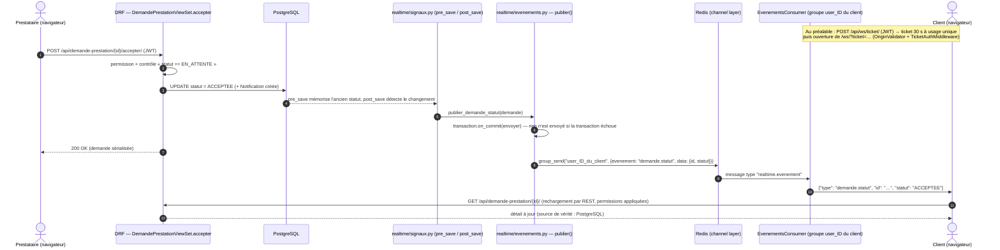

# 18 — Temps réel : Django Channels, Redis, WebSocket

Document détaillé existant : [`docs/temps-reel.md`](../temps-reel.md). Résumé ici.

## Principe

**REST = actions, WebSocket = événements.** Toute action passe par l'API REST et
est enregistrée dans PostgreSQL. Le WebSocket envoie seulement « tel objet a
changé » ; le navigateur recharge ensuite l'objet par REST, avec les permissions
habituelles. Si Redis ou le WebSocket tombe, **aucune donnée n'est perdue** :
l'application fonctionne, elle est seulement moins réactive.

## Les pièces

| Pièce | Fichier | Rôle |
|---|---|---|
| Serveur ASGI | Daphne (`CMD` du Dockerfile), `config/asgi.py` | sert HTTP **et** WebSocket |
| Routeur | `config/asgi.py` | `ProtocolTypeRouter` : `http` → Django, `websocket` → `OriginValidator(TicketAuthMiddleware(URLRouter(...)))` |
| Route | `apps/realtime/routing.py` | une seule route : `/ws/` → `EvenementsConsumer` |
| Ticket | `apps/realtime/views.py` (`TicketWebSocketView`), `tickets.py` | `POST /api/ws/ticket/` (JWT) → ticket usage unique, 30 s, stocké haché (SHA-256) dans le cache |
| Authentification WS | `apps/realtime/middleware.py` (`TicketAuthMiddleware`) | lit `?ticket=`, le consomme (`cache.adelete` : un seul gagnant), attache l'utilisateur ; sinon connexion refusée |
| Origine | `OriginValidator(CORS_ALLOWED_ORIGINS)` | refuse un site tiers qui tenterait d'ouvrir le WebSocket |
| Consumer | `apps/realtime/consumers.py` (`EvenementsConsumer`) | à la connexion : groupe `user_<id>` + groupe `admins` si `is_admin_user` ; envoie `realtime.connected` ; ignore ce que le navigateur envoie ; `realtime_evenement` relaie les événements |
| Publication | `apps/realtime/evenements.py` (`publier`) | **seul** fichier qui envoie ; attend `transaction.on_commit` ; ne garde que `CHAMPS_AUTORISES = {"id", "statut", "etape"}` ; destinataires calculés depuis l'objet en base |
| Déclencheurs | `apps/realtime/signaux.py` | `pre_save` (ancien statut) + `post_save` (création / changement de statut) |
| Channel layer | `config/settings.py` | `RedisChannelLayer` (expiry 60 s) si `REDIS_URL`, sinon `InMemoryChannelLayer` (un seul processus) |
| Cache | `config/settings.py` | `RedisCache` (`KEY_PREFIX "mimosy"`) si `REDIS_URL`, sinon mémoire locale |

## Événements réellement publiés

| Événement | Déclencheur | Destinataires |
|---|---|---|
| `message.nouveau` | création d'un `Message` | destinataire |
| `notification.nouvelle` | création d'une `Notification` | propriétaire |
| `demande.nouvelle` / `demande.statut` | `DemandePrestation` créée / statut changé | client et prestataire |
| `devis.nouveau` / `devis.statut` | `DemandeDevis` créée, `ReponseDevis` créée / statut changé | participants du devis |
| `rendezvous.nouveau` / `rendezvous.statut` | `RendezVous` | client et prestataire |
| `litige.nouveau` / `litige.statut` / `litige.preuve` | `Litige`, `PreuveLitige` | participants + `admins` |
| `verification.analyse` (`etape` LECTURE / EXTRACTION / COMPARAISON) | `analyser_document` (si IA active) | prestataire |
| `verification.a_verifier` | statut `A_VERIFIER` | prestataire + `admins` |
| `verification.validee` / `verification.rejetee` | statut `VALIDE` / `REJETE` | prestataire |

**NON PRÉSENT DANS LE CODE** : `litige.message`, événement de paiement,
présence en ligne, « en train d'écrire », suivi GPS en direct.

## Exemple réel : le prestataire accepte une demande

Code Mermaid : [`diagrammes/sequence-temps-reel.mmd`](diagrammes/sequence-temps-reel.mmd).

## Côté frontend

| Fichier | Rôle |
|---|---|
| `src/services/realtime.js` | une seule connexion par onglet ; demande le ticket via `apiFetch` ; `ws(s)://…/ws/?ticket=…` ; reconnexion avec attente croissante 1 s → 30 s ; émet `realtime.reconnecte` |
| `src/stores/realtime.js` | état de la connexion ; recharge les notifications à chaque événement utile |
| `src/composables/useEvenementTempsReel.js` | abonnement d'une vue à un type d'événement, désabonnement automatique |
| Branchements | `ClientLayout`, `AppLayout` (connexion), `stores/auth.js` (fermeture à la déconnexion), `MessagingWorkspace`, client `MesDemandes` / `DetailsDemandes` / `MesLitiges`, prestataire `Demandes` / `Verification` / `MesLitiges`, admin `Verifications` / `Litiges` |

Les pages **devis** et **rendez-vous** du frontend ne sont **pas encore
abonnées** aux événements `devis.*` et `rendezvous.*` (publiés par le backend) :
elles se mettent à jour au rechargement.

## Redis dans MIMOSY

Redis sert à deux choses : **transporter les événements** entre les processus
(channel layer) et **stocker les tickets** WebSocket (cache partagé). Dans Docker
il tourne **sans persistance** (`--save "" --appendonly no`) : son contenu est
éphémère par nature (événements instantanés, tickets de 30 s).

### Comment l'expliquer à l'oral ?

> « Quand le prestataire accepte, la vue REST enregistre en base. Un signal
> publie, après la validation de la transaction, un événement minimal dans Redis
> vers le groupe du client. Son navigateur reçoit "demande.statut" et recharge la
> demande par l'API. Le WebSocket prévient, l'API fait foi. Et pour se connecter,
> on échange son JWT contre un ticket de 30 secondes à usage unique. »
