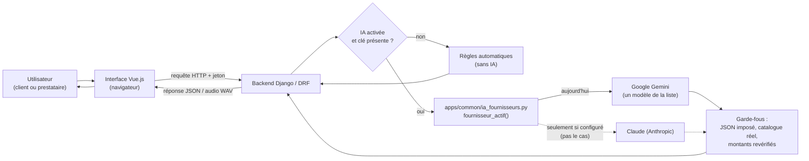
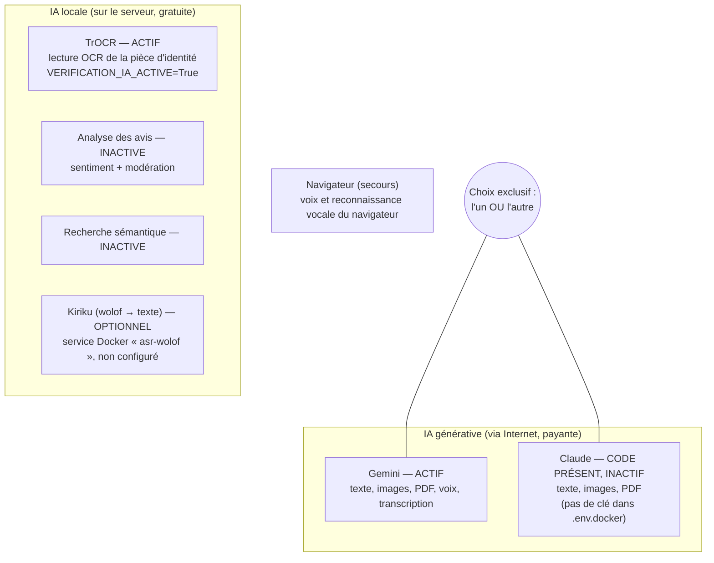
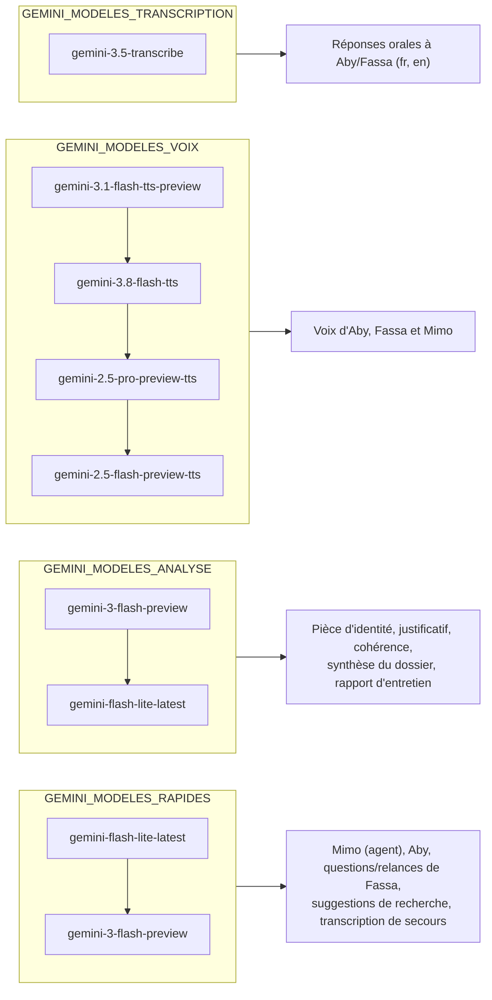
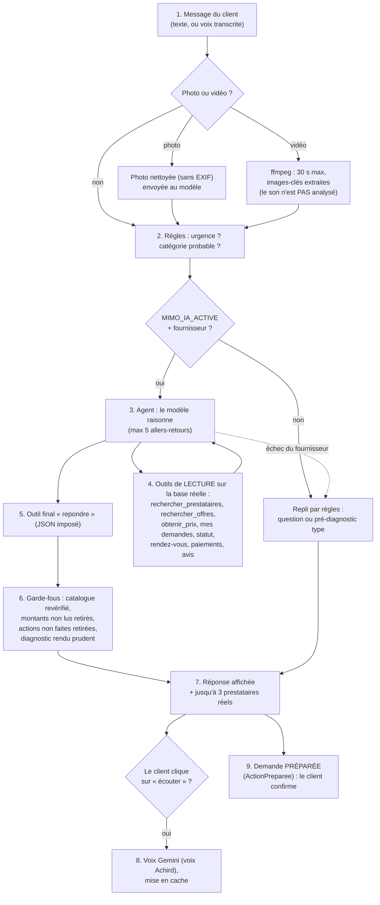

# COMPRENDRE L'INTELLIGENCE ARTIFICIELLE DE MIMOSY — GUIDE DU DÉBUTANT

> Audit réalisé le 9 octobre 2026 à partir du code réel du dépôt `back_Mimosy`
> (et d'un coup d'œil au frontend `mimosy`). Aucun code n'a été modifié, aucun
> appel payant à une IA n'a été lancé, aucune clé n'est affichée.

---

## 0. Résumé en une page

**Ce que fait l'IA dans MIMOSY.** Trois assistantes / assistants parlent aux utilisateurs :

| Nom | Pour qui | Rôle réel (prouvé par le code) |
|---|---|---|
| **Mimo** | le client | comprend le besoin, regarde une photo ou des images d'une vidéo, consulte les vraies données de MIMOSY (prestataires, prix, demandes, rendez-vous, paiements, avis) avec 8 « outils » de lecture, propose un pré-diagnostic prudent et jusqu'à 3 prestataires |
| **Aby** | le prestataire | l'aide à remplir son profil professionnel (questions courtes, extraction des réponses) |
| **Fassa** | le prestataire | mène un entretien vocal de 5 minutes maximum, puis rédige un rapport pour l'administrateur |

S'y ajoutent des traitements sans « personnage » : lecture de la pièce d'identité et du justificatif, contrôle de cohérence, synthèse du dossier, suggestions de recherche.

**Un seul fournisseur à la fois.** Tout passe par un seul fichier :
[`apps/common/ia_fournisseurs.py`](../apps/common/ia_fournisseurs.py). La fonction
`fournisseur_actif()` choisit **un** fournisseur : Gemini (Google) **ou** Claude
(Anthropic). Il n'y a **pas** de bascule de Gemini vers Claude en cas de panne.

**Ce qui tourne vraiment chez vous.** Le fichier `.env.docker` réellement lu par
Docker contient `IA_FOURNISSEUR=gemini`, une clé Gemini renseignée, **aucune** clé
Claude, `PARCOURS_IA_ACTIVE=true` et `VOIX_WOLOF=gemini`. Donc aujourd'hui :
**seul Gemini est appelé**. Le code Claude existe mais dort.

> ⚠️ Les valeurs que vous m'avez données (`IA_FOURNISSEUR=auto`,
> `PARCOURS_IA_ACTIVE=false`…) sont celles du **modèle** `.env.docker.example`,
> pas celles de votre `.env.docker`. Les variables de modèles absentes de
> `.env.docker` prennent les valeurs par défaut de `config/settings.py`, qui sont
> identiques à celles de l'exemple.

**Plusieurs modèles, mais un seul à la fois par opération.** Pour chaque tâche,
le code a une *liste* de modèles : il essaie le premier ; s'il est saturé, retiré
ou à court de quota, il passe au suivant. Si tous échouent, MIMOSY applique des
**règles automatiques** (sans IA) : l'application reste utilisable.

**Quatre familles de modèles Gemini** : *rapides* (conversation), *analyse*
(documents, rapports), *voix* (lecture à voix haute), *transcription* (voix → texte).

**Autres IA, locales et gratuites** (pas Gemini, pas Claude) : un OCR TrOCR pour la
pièce d'identité (actif), l'analyse des avis et la recherche sémantique (désactivées),
et Kiriku pour transcrire le wolof (service optionnel, non configuré).

**Recommandation (option A)** : assumer « Gemini seul » — c'est déjà la réalité —
et clarifier la configuration. Rien n'a été modifié : j'attends votre accord.

---

## 1. Les notions de base

### 1.1 Qu'est-ce qu'une intelligence artificielle ?

- **Définition simple** : un programme qui a appris, à partir d'énormément d'exemples,
  à produire une réponse plausible (un texte, une voix, une description d'image).
- **Exemple** : on écrit « mon robinet fuit sous l'évier », l'IA comprend qu'il
  s'agit de plomberie.
- **Vie quotidienne** : un apprenti qui a observé des milliers de réparations. Il
  devine très bien, mais il peut se tromper : il faut un maître qui vérifie.
- **Dans MIMOSY** : l'IA ne décide jamais seule. Mimo ne fait qu'un
  *pré-diagnostic* (« pourrait être lié à… ») et Fassa ne donne jamais de note :
  c'est l'administrateur qui valide un prestataire (consignes dans
  [`apps/verification/ia.py`](../apps/verification/ia.py) et
  [`apps/mimo/agent.py`](../apps/mimo/agent.py)).

### 1.2 Qu'est-ce qu'un fournisseur d'IA ?

- **Définition** : l'entreprise qui fabrique les modèles et les loue via Internet.
- **Exemple** : Google fournit Gemini ; Anthropic fournit Claude.
- **Vie quotidienne** : un opérateur téléphonique (Orange, Free…). On ne
  construit pas les antennes ; on paie pour utiliser leur réseau.
- **Dans MIMOSY** : variable `IA_FOURNISSEUR` (`gemini`, `anthropic` ou `auto`).

### 1.3 Qu'est-ce qu'un modèle d'IA ?

- **Définition** : une version précise du « cerveau » proposé par le fournisseur,
  avec un nom exact, par exemple `gemini-3-flash-preview`.
- **Exemple** : un modèle « lite » répond vite et coûte peu ; un modèle de voix
  ne sait que transformer du texte en audio.
- **Vie quotidienne** : chez un même opérateur, plusieurs forfaits ; chez un
  constructeur, plusieurs modèles de voiture (citadine, camion).
- **Dans MIMOSY** : les listes `GEMINI_MODELES_RAPIDES`, `..._ANALYSE`, `..._VOIX`,
  `..._TRANSCRIPTION`.

### 1.4 Gemini ou « un modèle Gemini » ?

- **Gemini** = la *famille* de produits IA de Google (la marque).
- **Un modèle Gemini** = un membre précis de la famille, avec un nom exact
  (`gemini-flash-lite-latest`, `gemini-2.5-flash-preview-tts`…).
- **Vie quotidienne** : « Toyota » est la marque, « Corolla » est un modèle.
- **Dans MIMOSY** : la clé `GEMINI_API_KEY` ouvre l'accès à *toute la famille* ;
  ce sont les listes de modèles qui disent *lequel* appeler pour chaque tâche.

### 1.5 Gemini ou Claude ?

- Deux fournisseurs concurrents, deux entreprises différentes, deux clés différentes.
- **Différence qui compte dans MIMOSY** : Gemini sait faire **texte, images, PDF,
  voix et transcription**. Dans le code de MIMOSY, Claude ne sert qu'au **texte,
  aux images et aux PDF** — pas à la voix ni à la transcription
  (`voix_disponible()` exige Gemini, `transcrire()` aussi).
- **Vie quotidienne** : deux garages. L'un fait mécanique *et* carrosserie,
  l'autre seulement mécanique. Si on va chez le second, il faut un autre garage
  pour la carrosserie.

### 1.6 API et clé API

- **API** (*Application Programming Interface*, « interface de programmation ») :
  la façon normalisée dont deux programmes se parlent. Django envoie une demande
  structurée à Google et reçoit une réponse structurée.
- **Clé API** : un mot de passe qui prouve « c'est MIMOSY qui demande, facturez
  MIMOSY ».
- **Vie quotidienne** : l'API, c'est le guichet et son formulaire ; la clé, c'est
  votre carte d'abonné. Qui a la carte peut consommer à vos frais : on ne la
  montre jamais.
- **Dans MIMOSY** : la clé n'est lue que dans `config/settings.py` depuis
  l'environnement, jamais écrite dans le code ni dans les journaux. En tests
  automatisés, les clés sont **effacées de force** (`config/settings.py`, bloc
  `if ... == "test"`), donc aucun test ne consomme de crédits.

### 1.7 Pourquoi plusieurs modèles ?

1. **Spécialité** : un modèle de voix ne sait pas écrire de JSON ; un modèle de
   texte ne sait pas parler.
2. **Coût / vitesse** : la conversation veut de la vitesse (modèle « lite »), la
   lecture d'une pièce d'identité veut de la précision.
3. **Fiabilité** : les modèles « preview » ont des quotas faibles et peuvent
   disparaître. Une liste permet de continuer quand l'un tombe.

### 1.8 Pourquoi des modèles différents pour texte, image, transcription, voix ?

- **Texte et image** : le même modèle « multimodal » (qui comprend plusieurs
  types d'entrée) lit le texte et regarde la photo → c'est le cas de MIMOSY : les
  modèles *rapides* / *analyse* reçoivent aussi les images et PDF.
- **Transcription** (audio → texte) : un modèle dédié est plus rapide et précis.
- **Synthèse vocale** (texte → audio, *TTS* pour *Text-To-Speech*) : modèles à part,
  qui produisent un fichier son.
- **Vie quotidienne** : dans un hôpital, le généraliste, le radiologue et
  l'orthophoniste ne font pas le même métier.

### 1.9 Modèle principal et modèle de secours

- **Principal** : le premier de la liste, essayé en premier.
- **Secours** : les suivants, essayés seulement si le précédent échoue.
- **Vie quotidienne** : vous appelez votre plombier habituel ; s'il ne répond
  pas, vous appelez le deuxième numéro du carnet.
- **Dans MIMOSY** : fonction `_essayer_modeles()`. Bonus : un modèle à court de
  quota est mis **en pause** (jusqu'à 24 h, durée donnée par Google) et un modèle en
  panne est **écarté 5 minutes** (« disjoncteur »), pour ne pas attendre son refus
  à chaque phrase.

### 1.10 Plusieurs modèles en même temps ?

**Non, pour une opération donnée un seul modèle répond.** Les autres ne sont
appelés que si le précédent échoue, l'un après l'autre.

Mais **une action de l'utilisateur peut déclencher plusieurs opérations**, chacune
avec son modèle. Exemple pendant l'entretien de Fassa :

1. le prestataire parle → **modèle de transcription** ;
2. Fassa prépare sa relance → **modèle rapide** ;
3. la phrase est lue à voix haute → **modèle de voix** (lancé en arrière-plan
   dès que le texte existe : « préchauffage », `VOIX_PRECHAUFFAGE`).

---

## 2. L'architecture réelle de l'IA de MIMOSY

### A. Vue générale



À retenir : le navigateur ne parle **jamais** directement à Gemini. C'est Django
qui détient la clé, appelle l'IA, vérifie la réponse et la renvoie.

### B. Les fournisseurs et services IA présents



Relations réelles :

- **Gemini et Claude ne se relaient pas.** `fournisseur_actif()` renvoie l'un ou
  l'autre ; si Gemini échoue, on passe aux **règles**, pas à Claude.
- **Kiriku** est appelé *avant* Gemini pour le wolof, seulement si `ASR_WOLOF_URL`
  est rempli ; s'il échoue, Gemini prend le relais.
- **Le navigateur** sert de secours pour la voix (français, anglais) et pour la
  reconnaissance vocale (`mimosy/src/utils/voixNavigateur.js`,
  `mimosy/src/utils/mediaEntretien.js`).

### C. Les familles de modèles Gemini



Détails vérifiés dans le code :

- **Rapides et analyse contiennent les deux mêmes modèles, dans l'ordre inverse.**
  Et le code complète toujours une liste avec l'autre (`_gemini_json`, lignes
  228-231). En pratique : *deux* modèles de texte, l'ordre change selon la tâche.
- **L'agent Mimo** utilise *toujours* les rapides puis les analyse
  (`_gemini_outils`, ligne 634).
- **Analyse** = appels avec `rapide=False` : `apps/verification/analyses.py`
  (justificatif, pièce d'identité, cohérence, synthèse) et
  `apps/verification/entretien.py` ligne 907 (rapport de Fassa).
- **Transcription** : le modèle dédié n'est utilisé que pour le **français et
  l'anglais du parcours prestataire**. Pour le wolof → Kiriku si configuré, sinon
  un modèle rapide avec une consigne wolof. **Pour Mimo** (`TranscrireMimoView`,
  `langue="auto"`), c'est un **modèle rapide** qui transcrit et détecte la langue
  — le modèle dédié n'est **pas** utilisé.
- **Voix** : le wolof a sa propre liste (sans `gemini-3.8-flash-tts`, qui y
  produisait un audio invalide — incident du 2026-10-06, `docs/voix-assistantes.md`).

### D. Le fonctionnement de Mimo



| Étape | État | Preuve |
|---|---|---|
| Message texte | ✅ implémenté | `MimoView` (`apps/diagnosis/views.py`) |
| Voix → texte | ✅ implémenté (Gemini) | `TranscrireMimoView` |
| Photo | ✅ implémenté | `enregistrer_photo`, `DocumentIA` |
| Vidéo | ✅ images-clés seulement ; **son non analysé** ; exige ffmpeg | `extraire_images_video` (`apps/diagnosis/mimo.py`) |
| Recherche de prestataires réels | ✅ implémenté (outil de lecture) | `apps/mimo/outils/lecture.py` |
| Garde-fous | ✅ implémenté | `apps/mimo/garde_fous.py` |
| Lecture vocale de Mimo | ✅ implémenté (Gemini) | `VoixMimoView` |
| Préparer une demande | ✅ préparée, le client confirme | `ActionPreparee`, `ConfirmerMimoActionView` |
| Créer / payer / annuler **à la place** du client | ❌ **non** : aucun outil « sensible » n'est exposé au modèle | `outils_exposes()` n'expose que LECTURE et PREPARATION ; aucun outil PREPARATION n'est encore enregistré |
| Création effective de la demande après confirmation | À vérifier dans le frontend : la vue de confirmation ne fait que changer le statut de l'action | `ConfirmerMimoActionView` |

---

## 3. Les variables, une par une

Valeurs : **exemple** = `.env.docker.example` ; **réel** = votre `.env.docker`
(clés masquées). « Défaut » = valeur de `config/settings.py` quand la variable est absente.

| Variable | En français simple | Fonctionnalité | Où c'est lu / utilisé | Valeur exemple → réelle | Si vide / faux | Utilisée ? | Indispensable ? | Simplifiable ? |
|---|---|---|---|---|---|---|---|---|
| `IA_FOURNISSEUR` | Quel fournisseur appeler | Toute l'IA générative | `fournisseur_actif()` | `auto` → **`gemini`** | Vide = `auto` | Oui | Non (défaut `auto`) | Oui : `gemini` explicite suffit |
| `GEMINI_API_KEY` | Carte d'abonné Google | Tout Gemini | `fournisseur_actif()`, `_client_gemini()` | vide → **renseignée** | Plus d'IA : Mimo, Aby, Fassa passent aux règles ; pas de voix serveur ni transcription serveur | Oui | **Oui** pour avoir de l'IA | Non |
| `GEMINI_MODELES_RAPIDES` | Modèles pour répondre vite | Mimo, Aby, relances de Fassa, recherche, transcription de secours | `_gemini_json`, `_gemini_outils`, `nom_modele` | 2 modèles → absente (défaut identique) | Liste vide : seules les « analyse » sont essayées (le code complète) | Oui | Non (défaut) | Oui : identique au défaut, peut rester absente |
| `GEMINI_MODELES_ANALYSE` | Modèles pour lire et résumer avec soin | Documents, cohérence, synthèse, rapport | idem, `rapide=False` | idem | idem (inverse) | Oui | Non | Oui : mêmes 2 modèles que les rapides, ordre inversé |
| `GEMINI_MODELES_VOIX` | Modèles qui parlent | Voix d'Aby, Fassa, Mimo | `voix_disponible`, `synthese_vocale`, `modeles_voix`, `voix._synthetiser` | 4 modèles → absente (défaut identique) | Vide : plus de voix serveur, le navigateur lit (fr/en) ; en wolof, pas de voix | Oui | Non (défaut) | Peut-être 2-3 modèles suffisent ; les 4 multiplient les quotas gratuits |
| `GEMINI_MODELES_VOIX_WO` | Modèles de voix pour le wolof | Voix en wolof | `settings.GEMINI_MODELES_VOIX_PAR_LANGUE` | vide → absente | Vide = liste générale sans `gemini-3.8-flash-tts` | Oui (indirectement) | Non | Oui, la laisser vide |
| `GEMINI_VOIX_ABY` | Timbre de voix d'Aby | Aby | `agents_ia.ABY.voix` | `Sulafat` → défaut | Vide : nom de voix vide envoyé à Gemini → *à vérifier* (probable erreur → navigateur) | Oui | Non (défaut) | Oui |
| `GEMINI_VOIX_FASSA` | Timbre de voix de Fassa | Fassa | `agents_ia.FASSA.voix` | `Vindemiatrix` → défaut | idem | Oui | Non | Oui |
| *(`GEMINI_VOIX_MIMO`)* | Timbre de Mimo — **absente des exemples** | Mimo | `agents_ia.MIMO.voix` | défaut `Achird` | — | Oui | Non | À ajouter à l'exemple par cohérence |
| `GEMINI_MODELES_TRANSCRIPTION` | Modèle qui écrit ce qu'on dit | Réponses orales à Aby/Fassa (fr, en) | `transcrire()`, `_transcrire_modele_dedie` | `gemini-3.5-transcribe` → défaut | Vide : un modèle rapide transcrit à la place | Oui (pas pour Mimo ni le wolof) | Non | Oui |
| `ENTRETIEN_DUREE_MAX_SECONDES` | Durée max de l'entretien | Fassa | `apps/verification/entretien.py` (7 usages), `views_parcours.py` | `300` → défaut | Doit être un nombre (sinon Django ne démarre pas) | Oui | Non | Non |
| `THROTTLE_RATE_VOIX` | Limite d'appels voix/transcription par minute | Anti-abus du parcours prestataire | `REST_FRAMEWORK` (`settings.py:185`) → `VoixView`, `TranscrireView` | `60/min` → défaut | Vide = `60/min` | Oui (pas pour Mimo : scope `mimo`, 20/min) | Non | Oui |
| `PARCOURS_IA_ACTIVE` | Interrupteur de l'IA du parcours prestataire | Aby, Fassa, analyses | `apps/verification/ia.py` `ia_disponible()` | `false` → **`true`** | `false` : Aby/Fassa/analyses en règles, **et** plus de voix ni de transcription serveur dans le parcours | Oui | Oui si on veut l'IA du parcours | Non. **N'éteint ni Mimo ni la recherche** |
| `VERIFICATION_IA_MODELE` | Modèle **Claude** utilisé si Claude est le fournisseur | Claude (parcours, Mimo par défaut) | `_anthropic_json`, `_anthropic_outils`, `nom_modele` | `claude-opus-5-5` → défaut | Sans effet tant que Gemini est le fournisseur | **Non avec la config actuelle** | Non | Oui (nom trompeur ; à regrouper avec Claude) |
| `VERIFICATION_IA_TIMEOUT` | Temps d'attente max d'une réponse IA | **Gemini et Claude** (pas que Claude) | `_client_gemini`, `_anthropic_*` | `20` → défaut | Doit être un nombre | Oui | Non | Non (mais nom trompeur) |
| `PARCOURS_LANGUES` | Langues proposées par Aby/Fassa | Choix de langue du prestataire | `apps/common/langues.py` `codes_actifs()` | `fr,en,wo` → défaut | Le français est toujours ajouté | Oui (pas pour Mimo, qui accepte toujours fr/en/wo) | Non | Oui |
| `VOIX_WOLOF` | Autoriser la voix serveur en wolof | Aby, Fassa **et Mimo** en wolof | `langues.voix_serveur_disponible()` | vide → **`gemini`** | Vide : pas de voix en wolof, texte affiché | Oui | Non | Non. ⚠️ mode expérimental, à faire valider par un locuteur natif |
| `ASR_WOLOF_URL` | Adresse du service Kiriku | Transcription du wolof | `asr_wolof.transcrire()`, `transcrire()`, `views_parcours.py:125` | vide → absente | Vide : Gemini transcrit le wolof | Oui (code prêt) | Non | Non |
| `ASR_WOLOF_TIMEOUT` | Attente max de Kiriku | Kiriku | `asr_wolof.py` | `60` → défaut | Sans effet sans URL | Seulement si URL | Non | Oui |

**Variables liées absentes de votre liste mais importantes** :
`ANTHROPIC_API_KEY` (clé Claude, vide), `MIMO_IA_ACTIVE` (défaut **true**),
`MIMO_AGENT_ACTIF` (défaut true), `RECHERCHE_IA_ACTIVE` (**true** chez vous),
`RECHERCHE_IA_MODELE` (Claude seulement, défaut `claude-opus-5`),
`MIMO_MODELE_ANTHROPIC`, `VERIFICATION_IA_ACTIVE` (OCR local, **True**),
`VOIX_CACHE_SECONDES` (30 jours), `IA_PAUSE_APRES_ECHEC_SECONDES` (300).

---

## 4. Gemini et Claude : les réponses précises

**Pourquoi le projet contient-il les deux ?** L'historique du code le montre :
Claude était le premier fournisseur (commentaire de `settings.py` : « sans
ANTHROPIC_API_KEY, des règles… », modèle `claude-opus-5-5` par défaut). Gemini a été
ajouté ensuite pour la **voix** et la **transcription**, que le code n'implémente
qu'avec Gemini. Le module garde un format neutre pour pouvoir changer de fournisseur.

**Les deux sont-ils réellement appelés ?** **Non.** Avec votre `.env.docker`
(`IA_FOURNISSEUR=gemini`, pas de clé Claude), seul Gemini l'est.

**Qui utilise quoi ?**

| Fonctionnalité | Avec Gemini (actuel) | Si on passait à Claude |
|---|---|---|
| Mimo (agent à outils, photos) | ✅ | ✅ (`_anthropic_outils`) |
| Aby, Fassa (texte), analyses de documents | ✅ | ✅ (`_anthropic_json`) |
| Suggestions de recherche | ✅ | ✅ |
| Voix d'Aby, Fassa, Mimo | ✅ | ❌ → voix du navigateur (fr/en), rien en wolof |
| Transcription serveur | ✅ | ❌ → reconnaissance du navigateur ou saisie ; Mimo : erreur 503 « indisponible » |

**Claude est-il un secours quand Gemini échoue ?** **Non.** En cas d'échec de tous
les modèles Gemini, `IAErreur` est levée et l'appelant applique ses **règles**.
Les « secours » sont des **modèles Gemini** suivants, pas Claude. (Il existe une
option côté Claude, `fallbacks="default"`, mais elle ne relance qu'**un autre modèle
Claude**, et seulement quand Claude est le fournisseur.)

**`IA_FOURNISSEUR=auto` choisit-il automatiquement entre les deux ?** Oui, mais pas
au sens « le meilleur au cas par cas » : `auto` = **Gemini si sa clé existe, sinon
Claude**. Avec les deux clés, Claude n'est **jamais** utilisé. Il n'y a pas de
choix selon la tâche, ni de bascule en cas de panne.

**Pourquoi `VERIFICATION_IA_MODELE=claude-opus-5-5` alors que
`PARCOURS_IA_ACTIVE=false` ?** Parce que ce sont deux réglages indépendants :

- `VERIFICATION_IA_MODELE` dit *quel modèle Claude* appeler **si** Claude est le
  fournisseur. Il est rempli « au cas où », c'est une valeur par défaut héritée.
- `PARCOURS_IA_ACTIVE` allume ou éteint l'IA *du parcours prestataire* seulement.
- Dans l'exemple, les deux sont donc inactifs pour des raisons différentes. Dans
  votre vrai `.env.docker`, `PARCOURS_IA_ACTIVE=true` mais le fournisseur est
  Gemini : le modèle Claude reste sans effet.
- ⚠️ Piège : même avec `PARCOURS_IA_ACTIVE=false`, **Mimo appelle l'IA** dès qu'une
  clé existe (`MIMO_IA_ACTIVE` vaut `true` par défaut).

**Peut-on garder un seul fournisseur ?** **Oui : Gemini.** C'est la seule option qui
garde toutes les fonctionnalités (voix et transcription comprises). Garder seulement
Claude casserait la voix et la transcription serveur.

**Plusieurs fournisseurs sont-ils nécessaires ?** Aujourd'hui, **non**. Ce serait
justifié seulement si l'on voulait : (1) une vraie résilience (si Google tombe) —
ce qui demanderait du **nouveau code** ; ou (2) un modèle Claude pour une tâche
précise jugée meilleure (par exemple la lecture de documents) — idem, à coder.

---

## 5. Vérification des modèles configurés

Aucun modèle n'a été appelé pendant cet audit. « Indices » = preuves trouvées dans
le dépôt (journaux et documentation écrits pendant le développement).

| Identifiant | Type | Utilisé par | Passe au suivant si échec ? | Indices / alerte |
|---|---|---|---|---|
| `gemini-flash-lite-latest` | texte + vision | rapides (1er), analyse (2e) | Oui | Alias « latest » : le modèle derrière peut changer sans prévenir. `docs/parcours-verification.md` signale qu'un alias voisin (`gemini-flash-latest`) a été vu saturé |
| `gemini-3-flash-preview` | texte + vision | analyse (1er), rapides (2e) | Oui | « preview » : quotas faibles, peut être retiré (déjà vu avec `gemini-2.5-flash`) |
| `gemini-3.1-flash-tts-preview` | voix (TTS) | voix principale | Oui | Existe (réponses 429 de quota dans le journal du 2026-10-06) ; « preview » |
| `gemini-3.8-flash-tts` | voix | voix (2e), **exclu du wolof** | Oui | Existe, mais audio invalide en wolof (29,7 s pour 14 mots) |
| `gemini-2.5-pro-preview-tts` | voix | voix (3e) | Oui | Existe (429 dans le journal) ; ancienne génération |
| `gemini-2.5-flash-preview-tts` | voix | voix (4e) | Oui | Pas d'indice dans les journaux : **à vérifier** |
| `gemini-3.5-transcribe` | transcription | réponses orales fr/en du parcours | Oui, puis un modèle rapide | **Aucun indice** de fonctionnement réel dans le dépôt : **à vérifier** (consulter le tableau de bord Google AI Studio, gratuit) |
| `claude-opus-5-5` | texte + vision (Claude) | Claude seulement | Non entre modèles Claude côté code (l'option serveur `fallbacks` le fait côté Anthropic) | Identifiant valide d'Opus 5.5. Jamais appelé avec la config actuelle |
| `claude-opus-5` (`RECHERCHE_IA_MODELE`) | texte (Claude) | suggestions de recherche, si Claude | — | **À vérifier** : différent de `claude-opus-5-5`, possible ancien nom |
| `Sulafat`, `Vindemiatrix`, `Achird` | **noms de voix**, pas des modèles | Aby, Fassa, Mimo | — | Choisies après essais d'après les commentaires de `settings.py` |

Points d'attention sur la sélection :

- Le « passage au suivant » est **vérifié dans le code** (`_essayer_modeles`) et
  **testé avec des simulations** (`apps/mimo/tests_fournisseurs.py`,
  `apps/verification/tests_voix.py`), pas contre l'API réelle.
- Le code Claude utilise des options récentes (`thinking adaptive`,
  `output_config`, bêta `server-side-fallback-2026-07-01`) : **à vérifier** avec
  la version installée `anthropic==1.8.0` avant de l'activer, car ce chemin n'a pas
  tourné en conditions réelles.

---

## 6. Simplifier l'architecture (propositions — rien n'est modifié)

### Option A — Un seul fournisseur : Gemini

- **Avantages** : c'est déjà ce qui tourne ; une seule clé, une seule facture, une
  seule documentation ; toutes les fonctionnalités (voix, transcription) sont couvertes.
- **Inconvénients** : dépendance à Google ; si Google tombe, retour aux règles
  (l'application reste utilisable).
- **Coûts** : offre gratuite possible pour un prototype, mais quotas voix très bas ;
  **offre payante obligatoire avec de vraies données** (sur l'offre gratuite, Google
  peut réutiliser les contenus — dont des pièces d'identité).
- **Complexité** : la plus faible.
- **Conséquences** : Mimo, Aby, Fassa et la vérification inchangés.

### Option B — Gemini principal + Claude spécialisé

- **Avantages** : on pourrait confier à Claude une tâche précise (ex. lecture des
  documents) s'il s'y montre meilleur.
- **Inconvénients** : **le code actuel ne le permet pas** : un seul fournisseur pour
  tout. Il faudrait un réglage par tâche. Deux clés, deux factures, deux politiques
  de données à expliquer dans les CGU.
- **Coûts** : deux abonnements.
- **Complexité** : moyenne (nouveau code + tests).
- **Conséquences** : voix et transcription restent Gemini ; seule la tâche choisie change.

### Option C — Plusieurs fournisseurs avec vrai secours

- **Avantages** : si Gemini est en panne ou à court de quota, Claude prend le texte.
- **Inconvénients** : à coder (aujourd'hui `auto` ne fait pas ça) ; réponses de
  style différent selon le moment ; voix et transcription n'ont **aucun** secours
  Claude ; tests à doubler.
- **Coûts** : deux abonnements, même peu utilisés.
- **Complexité** : la plus élevée.
- **Conséquences** : Mimo, Aby, Fassa plus résistants pour le *texte* uniquement.

### Recommandation : **Option A**

Elle correspond exactement au code et à votre `.env.docker`. Changements que je
proposerais **après votre accord** (configuration et documentation seulement, aucune
fonctionnalité retirée) :

1. Dans `.env.docker.example` : `IA_FOURNISSEUR=gemini` et regrouper
   `VERIFICATION_IA_MODELE`, `ANTHROPIC_API_KEY`, `RECHERCHE_IA_MODELE`,
   `MIMO_MODELE_ANTHROPIC` dans une section « Claude — optionnel, inactif ».
2. Corriger le commentaire de `VERIFICATION_IA_TIMEOUT` : il s'applique aussi à Gemini.
3. Ajouter `GEMINI_VOIX_MIMO` à l'exemple (aujourd'hui seulement en défaut caché).
4. Signaler à côté de `PARCOURS_IA_ACTIVE` qu'il **n'éteint pas** Mimo
   (`MIMO_IA_ACTIVE`) ni la recherche (`RECHERCHE_IA_ACTIVE`).
5. Vérifier gratuitement dans Google AI Studio que `gemini-3.5-transcribe` et
   `gemini-2.5-flash-preview-tts` existent ; sinon les retirer des listes.
6. Envisager 2 ou 3 modèles de voix au lieu de 4 une fois l'offre payante active.
7. Garder le code Claude (il ne coûte rien tant qu'il n'y a pas de clé) et le
   présenter honnêtement comme « option prévue, non utilisée ».

---

## 7. Préparation au jury

### A. 30 secondes

> « MIMOSY met en relation des clients et des prestataires au Sénégal. L'IA y joue
> trois rôles : Mimo aide le client à décrire son problème et lui propose de vrais
> prestataires ; Aby aide le prestataire à remplir son profil ; Fassa lui fait passer
> un court entretien vocal. Nous utilisons Gemini de Google. L'IA propose, mais un
> humain décide, et si l'IA est en panne, des règles automatiques prennent le relais. »

### B. 1 minute

> « Le client écrit, parle ou envoie une photo à Mimo. Le serveur Django envoie la
> demande à Gemini, qui comprend le besoin. Mimo ne peut pas inventer : il consulte la
> base de MIMOSY avec des outils de lecture — prestataires, prix, statuts — et nos
> garde-fous retirent toute phrase qui affirmerait un prix non vérifié ou une action
> non faite. Côté prestataire, Aby guide le profil, Gemini lit la pièce d'identité et
> le diplôme, puis Fassa mène un entretien de cinq minutes en français, anglais ou
> wolof, avec une voix générée. Le rapport va à l'administrateur, qui décide. Nous
> avons plusieurs modèles Gemini car chaque tâche a son spécialiste — texte, voix,
> transcription — et une liste de secours si l'un est saturé. »

### C. 3 minutes (plan)

1. **Le problème** (20 s) : trouver un prestataire de confiance ; vérifier un
   prestataire coûte du temps à l'équipe.
2. **Le chemin d'une demande** (40 s) : navigateur Vue.js → Django → Gemini →
   garde-fous → réponse. La clé reste sur le serveur.
3. **Mimo** (40 s) : texte, voix, photo, images de vidéo (sans le son) ; outils de
   lecture ; au plus 3 prestataires réels ; demande préparée que le client confirme.
4. **Aby et Fassa** (40 s) : profil, documents, entretien vocal, rapport sans note ;
   l'administrateur décide.
5. **Fiabilité et coût** (30 s) : modèles de secours, pause d'un modèle à court de
   quota, cache des voix 30 jours, règles automatiques si tout échoue.
6. **Limites honnêtes** (30 s) : wolof expérimental, quotas de l'offre gratuite,
   données personnelles → offre payante obligatoire avant la mise en production.

### D. Schéma à reproduire au tableau

```
 [Utilisateur]
      │
 [Vue.js : navigateur]
      │  HTTP
 [Django : serveur] ── clé API (secrète) ──► [Gemini]
      │                                       ├─ modèle rapide   (discuter)
      │◄── réponse vérifiée (garde-fous) ──── ├─ modèle analyse  (lire documents)
      │                                       ├─ modèle voix     (parler)
      │  si panne : RÈGLES                    └─ modèle transcription (écouter)
 [Base de données : prestataires, prix…]  ◄── outils de lecture de Mimo
```

### E. Dix questions simples

1. **Quelle IA utilisez-vous ?** Gemini de Google, appelé par notre serveur Django.
2. **Pourquoi aussi Claude dans le code ?** C'était le premier fournisseur ; le code
   reste compatible, mais il n'est pas utilisé : pas de clé configurée.
3. **Que se passe-t-il si l'IA tombe en panne ?** On essaie le modèle suivant ; si
   tous échouent, des règles automatiques répondent. Le site reste utilisable.
4. **L'IA peut-elle inventer un prix ?** Elle ne lit les prix que dans notre base, et
   un garde-fou retire tout montant qu'elle n'a pas lu pendant le tour.
5. **L'IA valide-t-elle les prestataires ?** Non. Elle relève des faits et des points
   à vérifier ; un administrateur décide.
6. **Où est la clé API ?** Dans un fichier d'environnement du serveur, hors de Git,
   jamais envoyée au navigateur.
7. **Combien ça coûte ?** Chaque appel est facturé ; nous limitons le nombre d'appels
   par minute et gardons les voix en cache 30 jours.
8. **Comment l'IA parle-t-elle ?** Un modèle de synthèse vocale transforme le texte en
   fichier audio ; si c'est impossible, le navigateur lit le texte (français, anglais).
9. **Et le wolof ?** Proposé, mais expérimental : Gemini ne documente pas le wolof ; il
   faut une validation par des locuteurs natifs. Un modèle spécialisé (Kiriku) est
   prévu en option.
10. **Les données sont-elles protégées ?** La photo est nettoyée de ses métadonnées,
    les données personnelles sont masquées dans l'historique envoyé à Mimo ; mais la
    pièce d'identité est bien envoyée à Google : il faudra l'offre payante et
    l'information dans les CGU avant les vraies données.

### F. Cinq questions plus difficiles

1. **« Qu'est-ce qu'un agent, chez Mimo ? »** — Le modèle ne répond pas d'un coup :
   il peut demander à appeler un outil (par exemple « chercher des plombiers à
   Pikine »), notre code exécute la recherche dans la base et lui renvoie le
   résultat, jusqu'à cinq fois, puis il répond via l'outil « repondre » dont le
   format est imposé. Il ne peut appeler que des outils de lecture.
2. **« Comment garantissez-vous une réponse exploitable ? »** — Nous imposons un
   schéma JSON (structure obligatoire) ; les catégories sont une liste fermée tirée
   du catalogue ; puis le code revérifie tout dans la base.
3. **« Comment gérez-vous les quotas ? »** — Erreur 429 = quota épuisé : le modèle est
   mis en pause le temps indiqué par Google ; autre panne : écarté 5 minutes. Les
   phrases déjà générées sont en cache. *Limite honnête* : avec l'offre gratuite,
   les quotas de voix restent trop faibles pour un usage réel.
4. **« Votre "auto" est-il un équilibrage entre fournisseurs ? »** — Non, et je
   préfère être précis : `auto` choisit Gemini si sa clé existe, sinon Claude. Il n'y
   a pas de bascule entre fournisseurs ; ce serait une évolution à coder.
5. **« Comment testez-vous l'IA sans payer ? »** — En mode test, les clés sont
   effacées de force ; les tests simulent les réponses des fournisseurs. Cela vérifie
   notre logique (secours, garde-fous), pas la qualité réelle du modèle, que nous
   avons évaluée par des essais manuels.

### La question piège : « Pourquoi plusieurs modèles au lieu d'un seul ? »

> « Nous utilisons un seul fournisseur, Gemini, mais plusieurs modèles parce qu'aucun
> modèle ne fait tout : un modèle écrit, un autre parle, un autre écoute. Pour le
> texte, nous avons un modèle léger pour la conversation et un plus précis pour lire
> les documents. Enfin, chaque tâche a un modèle de secours : les modèles en
> pré-version ont des quotas faibles et peuvent disparaître, et nous l'avons vécu
> pendant le développement. Pour chaque opération, un seul modèle répond ; les autres
> n'interviennent que s'il échoue. »

### G. Fiche de révision

| Mot | Définition en une phrase | Analogie |
|---|---|---|
| **IA** | Programme qui a appris sur des exemples à produire une réponse plausible | Un apprenti très doué qu'on vérifie toujours |
| **Fournisseur** | Entreprise qui loue l'accès à ses modèles | L'opérateur téléphonique |
| **Modèle** | Version précise et spécialisée, avec un nom exact | Un modèle de voiture chez un constructeur |
| **API** | Façon normalisée pour deux programmes de se parler | Un guichet avec son formulaire |
| **Clé API** | Mot de passe qui identifie et facture MIMOSY | La carte d'abonné |
| **Transcription** | Audio → texte | La sténographe d'un tribunal |
| **Synthèse vocale (TTS)** | Texte → audio | Le lecteur qui lit le journal à voix haute |
| **Modèle de secours** | Modèle essayé si le précédent échoue | Le deuxième numéro du carnet |
| **Backend** | Partie serveur (Django) : règles, base, clés, appels à l'IA | La cuisine du restaurant |
| **Frontend** | Partie visible (Vue.js) dans le navigateur | La salle et le serveur qui prend la commande |

À éviter devant le jury (le code ne le prouve pas) : « Claude prend le relais quand
Gemini tombe », « Mimo réserve ou paie à la place du client », « Mimo comprend le son
des vidéos », « le wolof est validé », « l'IA décide qui est vérifié ».

---

## 8. Bilan de l'audit

### Fichiers analysés

- `apps/common/ia_fournisseurs.py`, `agents_ia.py`, `asr_wolof.py`, `langues.py`
- `config/settings.py` (sections IA, débits, mode test)
- `.env.docker` (noms et présence des valeurs seulement), `.env.docker.example`,
  `.env.example`, `.env.docker.prod.example`, `docker-compose.yml`
- `apps/mimo/agent.py`, `apps/mimo/outils/registre.py`, `apps/mimo/outils/lecture.py`
- `apps/diagnosis/mimo.py`, `apps/diagnosis/views.py`
- `apps/verification/ia.py`, `voix.py`, `views_parcours.py`, `analyses.py`,
  `entretien.py`, `services.py`, `apps.py`
- `apps/services/suggestions_ia.py`, `recherche_semantique.py`, `apps/reviews/services.py`
- `services/asr_wolof/serveur.py`
- Docs existantes : `docs/parcours-verification.md`, `docs/voix-assistantes.md`,
  `docs/CHANGELOG-IA.md`
- Frontend (recherche ciblée) : `mimosy/src/utils/voixNavigateur.js`,
  `mimosy/src/utils/mediaEntretien.js`, `mimosy/src/config/api.js`

### Points confirmés

- Un seul fournisseur actif à la fois ; aucune bascule Gemini → Claude.
- Configuration réelle : Gemini seul ; Claude jamais appelé.
- Voix et transcription : Gemini uniquement (+ Kiriku optionnel, + navigateur).
- Secours entre modèles Gemini, pause sur quota, disjoncteur de 5 minutes.
- Repli par règles pour Mimo, Aby, Fassa, la recherche.
- Mimo : outils de lecture uniquement ; vidéo analysée par images, sans le son.
- `PARCOURS_IA_ACTIVE` n'agit pas sur Mimo ; `VERIFICATION_IA_TIMEOUT` agit aussi sur Gemini.
- Aucune IA réelle en mode test.

### Points incertains (à vérifier)

- Existence / disponibilité actuelle de `gemini-3.5-transcribe` et
  `gemini-2.5-flash-preview-tts` (aucune trace d'utilisation réelle).
- Validité de `claude-opus-5` (`RECHERCHE_IA_MODELE`) et compatibilité des options
  Claude avancées avec `anthropic==1.8.0`.
- Comportement exact si `GEMINI_VOIX_*` est vide.
- Création effective de la demande après confirmation d'une action de Mimo (côté frontend).
- Qualité réelle du wolof (voix et transcription) : non mesurée.

### Recommandations

Option A (Gemini seul, configuration clarifiée) — détaillée en section 6.
**En attente de votre accord avant toute modification.**
