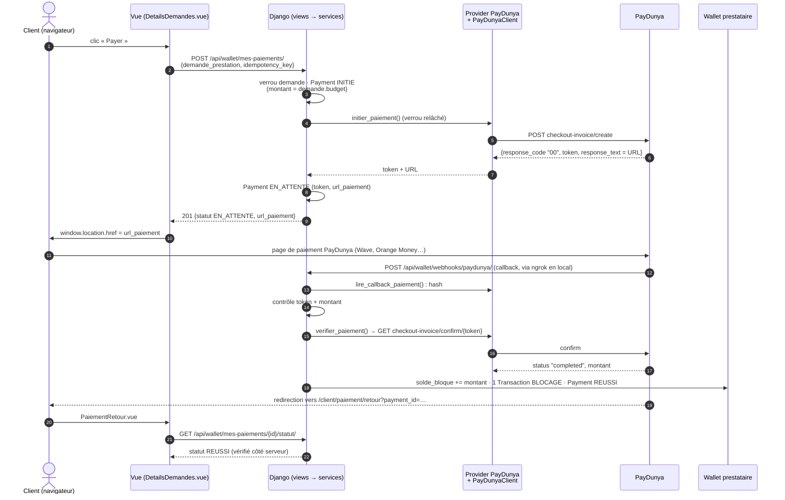

# Paiement client — PayDunya

Ce document explique comment un client MIMOSY paie une prestation, du clic sur « Payer » jusqu'au
blocage des fonds dans le wallet du prestataire. Il s'adresse à un développeur qui découvre le
code. La suite (commission, libération, retrait du prestataire) est dans `docs/wallet.md`.

> **État de validation.** Le code est couvert par des tests automatisés où PayDunya est remplacé
> par des réponses au format de sa documentation officielle, y compris des tests de concurrence
> réelle sur PostgreSQL. Un appel réel à l'API sandbox PayDunya (avec de fausses clés) a confirmé
> l'hôte et le format des réponses d'erreur. **Le parcours complet avec un compte PayDunya (clés de
> test réelles, page de paiement, paiement sandbox, callback reçu via ngrok) reste à valider** —
> voir section K.

## Vue d'ensemble



---

## A. Architecture

Chaque couche a un seul rôle :

```text
Vue (DetailsDemandes.vue, PaiementRetour.vue)   affichage et navigation — jamais de montant, jamais de clé
  ↓ walletService.payerDemande()
API Django : apps/wallet/views.py               HTTP : authentification, format, code de réponse
  ↓
apps/wallet/services.py                         règles métier et financières (verrous, statuts, wallet)
  ↓ get_provider()
PaymentProvider (providers/base.py)             interface commune + statuts normalisés
  ↓
PayDunyaPaymentProvider (providers/paydunya.py) traduction PayDunya ⇄ MIMOSY, vérification du hash
  ↓
PayDunyaClient (paydunya_client.py)             appels HTTP bruts (httpx), clés dans les en-têtes
  ↓
API PayDunya
```

`services.py` ne connaît **que** l'interface `PaymentProvider` et ses statuts normalisés
(`REUSSI`, `ECHOUE`, `EN_ATTENTE`, `INCONNU`). Il n'importe jamais `PayDunyaClient` et ne
manipule jamais les chaînes PayDunya (`completed`, `cancelled`…). Changer de fournisseur ne
toucherait que `providers/` et `paydunya_client.py`.

| Méthode du provider | Rôle |
|---|---|
| `initier_paiement(payment)` | créer la facture, renvoyer token + URL de paiement |
| `verifier_paiement(payment)` | demander l'état réel d'une facture (`checkout-invoice/confirm`) |
| `lire_callback_paiement(donnees, hash)` | authentifier et lire un callback de paiement |
| `initier_retrait` / `verifier_retrait` / `lire_callback_retrait` | idem pour les retraits |

Deux fournisseurs, choisis par `PAYMENT_PROVIDER` :

- `sandbox` (défaut) : `SandboxProvider`, paiement réussi immédiatement, aucune redirection,
  aucun appel externe — pour développer sans compte PayDunya ;
- `paydunya` : `PayDunyaPaymentProvider`, redirection vers la vraie page PayDunya
  (`PAYDUNYA_MODE=test` : sandbox PayDunya, argent fictif ; `live` : argent réel).

## B. Création du paiement

`POST /api/wallet/mes-paiements/` avec `{demande_prestation, idempotency_key}` — **jamais de
montant** : un champ `montant` envoyé par le frontend est ignoré.

`services.initier_paiement()` :

1. **Idempotence** : même `idempotency_key` → même paiement.
2. **Hors verrou** : les `INITIE` trop anciens passent `ECHOUE` (section H) ; un `EN_ATTENTE`
   existant est revérifié auprès de PayDunya (payé entre-temps ? facture expirée ?).
3. **Sous verrou de la demande** : refus si déjà payée ou si la demande n'est pas `ACCEPTEE` ;
   renvoi du paiement en cours s'il y en a un ; sinon création d'un `Payment` `INITIE` avec
   `montant = demande.budget`.
4. **Hors verrou** : `PayDunyaClient.creer_facture_paiement()` → `checkout-invoice/create` avec
   `invoice.total_amount`, `custom_data.payment_id`, `callback_url`, `return_url`, `cancel_url`.

Réponse documentée par PayDunya :

```json
{
  "response_code": "00",
  "response_text": "https://app.paydunya.com/sandbox-checkout/invoice/test_RHICF0HboN",
  "description": "Checkout Invoice Created",
  "token": "test_RHICF0HboN"
}
```

`response_text` **est** l'URL de la page de paiement. Le provider exige un `token` et une URL en
`https://` ; sinon, ou si PayDunya est injoignable, le paiement passe `ECHOUE` (pas d'erreur 500)
et le client peut réessayer. Sinon : `Payment` `EN_ATTENTE`, `reference_externe = token`,
`url_paiement = URL`, réponse **201**.

## C. Redirection vers PayDunya

- `DetailsDemandes.vue`, fonction `payer()` :
  `if (statut === 'EN_ATTENTE' && url_paiement) window.location.href = url_paiement`.
  C'est une vraie navigation : le navigateur **quitte MIMOSY** et affiche la page PayDunya. Pas de
  `router.push` (réservé aux routes Vue), pas d'iframe, pas de page qui imite PayDunya. Sans URL,
  aucune redirection.
- L'URL est stockée dans `Payment.url_paiement` pour qu'un client qui revient (autre onglet,
  navigateur fermé) **reprenne la même facture** (« Reprendre le paiement ») au lieu d'en créer
  une seconde.
- `PaymentSerializer.get_url_paiement` ne la renvoie **qu'au client propriétaire** et **tant que
  le paiement est `EN_ATTENTE`** (jamais à un admin ni à un autre utilisateur).
- Aucune URL PayDunya n'est écrite en dur côté frontend.

## D. Webhook (callback PayDunya)

`POST /api/wallet/webhooks/paydunya/` est **public** : ce sont les serveurs PayDunya qui
l'appellent. Sa sécurité vient des contrôles, pas d'une authentification. Format documenté
(formulaire « tableau PHP ») :

```text
data[hash]=…&data[status]=completed&data[invoice][token]=test_…&data[invoice][total_amount]=42300
&data[custom_data][payment_id]=<uuid>
```

`views._deplier_champs_php()` reconstruit le dictionnaire, puis
`services.traiter_callback_paiement_paydunya()` vérifie, dans l'ordre :

1. **authenticité** : `hash` = SHA-512 de la Master Key (`hmac.compare_digest`, par le provider) ;
2. **paiement** : retrouvé par `custom_data.payment_id` (notre propre identifiant) ;
3. **token** : `invoice.token` présent et égal à `Payment.reference_externe` ;
4. **montant** : `invoice.total_amount` présent et égal à `Payment.montant` ;
5. **confirmation** : pour un succès annoncé, MIMOSY **redemande le statut** à PayDunya
   (`checkout-invoice/confirm/<token>`) et ne bloque les fonds que si PayDunya confirme
   `completed` avec le bon montant.

La vue répond **toujours 200**, même en cas de rejet : une erreur HTTP ferait réessayer PayDunya
sans jamais changer l'issue. Chaque rejet est journalisé (sans hash, clé ni token).

## E. Vérification active

Le retour du navigateur n'est **jamais** une preuve de paiement (le client peut revenir sans
avoir payé). `GET /api/wallet/mes-paiements/<id>/statut/` (propriétaire uniquement) appelle
`services.verifier_statut_paiement()`, qui interroge PayDunya via le provider :

| PayDunya (`status`) | MIMOSY |
|---|---|
| `pending` (ou `created`) | reste `EN_ATTENTE` |
| `completed` (ou `success`) | `REUSSI` si token et montant concordent |
| `cancelled`, `failed` | `ECHOUE` |
| statut inconnu, `response_code` ≠ `00`, erreur réseau | rien ne change |

Selon la documentation PayDunya, une facture impayée passe d'elle-même `cancelled` après 24 h.

Côté frontend, `PaiementRetour.vue` extrait l'UUID de `payment_id` (PayDunya ajoute `?token=…` à
`return_url`, ce qui peut donner `payment_id=<uuid>?token=…` ou `…&token=…`), puis interroge
`/statut/` toutes les 4 s pendant 60 s tant que le paiement est `INITIE` ou `EN_ATTENTE`.
« Paiement réussi » ne s'affiche que si **le backend** répond `REUSSI`.

## F. Wallet

`services.marquer_paiement_reussi()` est le **seul** endroit qui bloque des fonds pour un
paiement. Sous `transaction.atomic()`, il verrouille dans cet ordre — toujours le même, pour
éviter les interblocages — la demande, le paiement, puis le wallet ; il relit le statut **sous
verrou**, ajoute le montant à `solde_bloque` et crée **une** `Transaction` `BLOCAGE`. Un paiement
déjà `REUSSI` ou `A_REMBOURSER` ne produit plus rien. La suite (commission, libération, retrait) :
`docs/wallet.md`.

## G. Idempotence

| Répétition | Effet |
|---|---|
| même `idempotency_key` rejouée | même paiement (refus si la clé appartient à un autre client) |
| même clé, deux requêtes simultanées | l'`IntegrityError` de la contrainte d'unicité est rattrapée : le paiement de la première est renvoyé, pas de 500 |
| callback reçu deux fois | le second ne fait rien (statut relu sous verrou) |
| callback + vérification en même temps | un seul blocage (verrous) |

La clé d'idempotence **ne suffit pas** contre deux onglets (deux clés différentes) : c'est le
rôle de la section H.

## H. Concurrence : une seule facture par demande

Règle : au plus **un paiement actif** (`INITIE`, `EN_ATTENTE` ou `REUSSI`) par demande.

| Situation | Réponse de `POST /mes-paiements/` | Frontend |
|---|---|---|
| aucun paiement actif (ou seulement des `ECHOUE`) | nouveau paiement + nouvelle facture (201) | redirection |
| `EN_ATTENTE` | le même paiement et la même `url_paiement` (200) | « Reprendre le paiement » |
| `INITIE` récent | le même paiement, sans URL (200) | « Paiement en cours de préparation… » |
| `REUSSI` | refus (400) | « Paiement réussi » |

- La décision est prise **sous verrou** (`select_for_update` sur la demande) et le `INITIE` est
  écrit **avant** de relâcher ce verrou : une requête concurrente attend, puis le voit.
- L'appel HTTP à PayDunya est fait **après** avoir relâché le verrou : PayDunya peut mettre
  plusieurs secondes à répondre, on ne bloque jamais la base pendant ce temps.
- Filet de sécurité SQL : la contrainte `un_seul_paiement_actif_par_demande` (index unique partiel
  PostgreSQL) refuse un second paiement actif même si un futur code oubliait le verrou.
- **Délai `INITIE`** : si un `INITIE` dure plus de `PAYMENT_INITIE_TIMEOUT_MINUTES` (défaut 10),
  PayDunya n'a jamais répondu (serveur arrêté pendant l'appel…) : il passe `ECHOUE` au clic suivant,
  ce qui autorise une nouvelle tentative. Une réponse tardive de PayDunya ne le « ressuscite » pas.

## I. Remboursement manuel — `A_REMBOURSER`

Si PayDunya confirme un paiement alors qu'un **autre** paiement de la même demande est déjà
`REUSSI` (par exemple une ancienne facture payée malgré tout), ce paiement passe `A_REMBOURSER` :

- aucun fonds bloqué, aucune `Transaction`, wallet inchangé ;
- réponse 200 au callback (pas de retries PayDunya) ;
- journal de niveau ERROR ;
- visible dans l'admin Django (filtre « Statut ») et dans la page admin Paiements du frontend.

**Le remboursement est manuel**, depuis le tableau de bord PayDunya : aucune API de
remboursement PayDunya n'est utilisée dans ce projet. `A_REMBOURSER` diffère d'`ANNULE`, qui
signifie que le paiement n'a pas abouti.

Cas inverse : si c'est une tentative **non payée** qui coexiste avec le paiement confirmé,
celle-ci passe `ECHOUE` et le paiement confirmé devient `REUSSI`.

## J. Variables d'environnement

Dans `back_Mimosy/.env.docker` (Docker) ou `back_Mimosy/.env` (poste). **Ces deux fichiers sont
ignorés par Git** ; les modèles versionnés sont `.env.docker.example` et `.env.example`, avec des
valeurs vides.

| Variable (lue dans `config/settings.py`) | Rôle | Sandbox PayDunya |
|---|---|---|
| `PAYMENT_PROVIDER` | `sandbox` ou `paydunya` | `paydunya` |
| `PAYDUNYA_MODE` | `test` (sandbox PayDunya) ou `live` | `test` |
| `PAYDUNYA_MASTER_KEY`, `PAYDUNYA_PRIVATE_KEY`, `PAYDUNYA_TOKEN` | clés du compte PayDunya | clés **de test** |
| `PAYDUNYA_CALLBACK_URL` | URL publique du webhook de paiement | URL ngrok (section K) |
| `PAYDUNYA_PAYOUT_CALLBACK_URL` | URL publique du webhook de retrait | facultatif pour tester un paiement |
| `ALLOWED_HOSTS` | domaines acceptés par Django | ajouter le domaine ngrok |
| `FRONTEND_BASE_URL` | base de `return_url` / `cancel_url` | `http://localhost:5173` |
| `PAYMENT_INITIE_TIMEOUT_MINUTES` | délai d'abandon d'un `INITIE` | `10` |
| `COMMISSION_TAUX` | commission MIMOSY à la libération | `0.10` |

Les noms de variables utilisent des **tirets bas** (`PAYDUNYA_MASTER_KEY`). Les tirets
(`PAYDUNYA-MASTER-KEY`) sont les noms des **en-têtes HTTP** envoyés à PayDunya.

Avec Docker, les variables sont lues à la **création** du conteneur : après modification,
`docker compose up -d backend` (un simple `restart` ne relit pas `.env.docker`).

Vérifier sans afficher de secret :

```bash
docker compose exec backend python manage.py shell -c "
from django.conf import settings as s
print(s.PAYMENT_PROVIDER, s.PAYDUNYA_MODE, bool(s.PAYDUNYA_MASTER_KEY), bool(s.PAYDUNYA_PRIVATE_KEY),
      bool(s.PAYDUNYA_TOKEN), s.PAYDUNYA_CALLBACK_URL, s.ALLOWED_HOSTS)"
```

## K. Développement local avec ngrok

- **Redirection** (navigateur → PayDunya) et **retour** (PayDunya → navigateur → `localhost:5173`)
  fonctionnent sans rien faire : c'est le navigateur du client qui se déplace.
- **Callback** (serveurs PayDunya → MIMOSY) : les serveurs PayDunya **ne peuvent pas** joindre
  `http://localhost:8000`. ngrok ouvre une URL publique temporaire vers le backend local.

```bash
ngrok http 8000                  # → Forwarding https://<id>.ngrok-free.app -> http://localhost:8000
```

Dans `back_Mimosy/.env.docker` :

```env
PAYDUNYA_CALLBACK_URL=https://<id>.ngrok-free.app/api/wallet/webhooks/paydunya/
ALLOWED_HOSTS=localhost,127.0.0.1,<id>.ngrok-free.app
```

Puis `docker compose up -d backend`, et contrôle :

```bash
curl -s -o /dev/null -w "%{http_code}\n" -X POST https://<id>.ngrok-free.app/api/wallet/webhooks/paydunya/
# 200 attendu (callback vide rejeté proprement) ; 400 = domaine absent d'ALLOWED_HOSTS
```

L'interface locale de ngrok (http://127.0.0.1:4040) montre chaque requête reçue, dont les
callbacks PayDunya. Avec le plan gratuit, le domaine change à chaque lancement de ngrok : mettre à
jour les deux variables et recréer le backend.

Parcours de test : client connecté sur une demande `ACCEPTEE` → « Payer » → réponse
`POST /mes-paiements/` avec `url_paiement` en `https://app.paydunya.com/sandbox-checkout/invoice/…`
→ la page PayDunya s'affiche → payer avec un moyen de test **fourni par PayDunya** → logs
`docker compose logs -f backend` (lignes `apps.wallet`) → « Paiement réussi » → admin : `Payment`
`REUSSI`, `solde_bloque` = budget, une seule `Transaction` `BLOCAGE`.

### Vérifier les clés sans rien créer

Un appel à `checkout-invoice/confirm` avec un token inexistant ne crée rien chez PayDunya et
distingue clairement les deux cas :

```bash
docker compose exec backend python manage.py shell -c "
from apps.wallet.paydunya_client import PayDunyaClient
r = PayDunyaClient().confirmer_facture_paiement('test_verification_inexistant')
print(r.get('response_code'), r.get('response_text'))"
```

- `4004 No Transaction Found.` : PayDunya **accepte** les clés (il a cherché la facture) ;
- `1001 Invalid Masterkey Specified` : clés refusées (voir « Dépannage »).

### Vérifier la sécurité du webhook sur le serveur en marche

Un callback forgé doit toujours être rejeté (réponse 200 avec un `detail`, aucune donnée
modifiée) : mauvais `hash` → « hash invalide » ; `payment_id` inconnu ou mal formé → « Aucun
paiement MIMOSY » ; paiement non confié à PayDunya → « n'a pas été confié à PayDunya » ; mauvais
token ou montant → rejet explicite (couvert par `apps/wallet/tests.py`, qui exige un paiement
`EN_ATTENTE`). Ne jamais afficher le hash valide : c'est l'empreinte de la Master Key.

## L. Passage Sandbox → production

1. Compte marchand PayDunya **activé** en production ; récupérer les clés **live**.
2. Sur le serveur uniquement (jamais dans Git) : `PAYMENT_PROVIDER=paydunya`,
   `PAYDUNYA_MODE=live`, clés live, `DEBUG=False`.
3. `PAYDUNYA_CALLBACK_URL` / `PAYDUNYA_PAYOUT_CALLBACK_URL` sur le **domaine HTTPS de production**
   (plus de ngrok) ; `ALLOWED_HOSTS` et `FRONTEND_BASE_URL` sur ce domaine.
4. `PayDunyaClient` bascule alors de `…/sandbox-api/v1` vers `…/api/v1` (aucun changement de code).
5. Premier paiement réel d'un petit montant, puis vérification : callback reçu, `REUSSI`,
   `solde_bloque`, une seule `BLOCAGE`.
6. Retraits : la documentation PayDunya ne décrit pas d'hôte de test distinct pour le
   déboursement (voir `docs/wallet.md`) — tester avec un petit montant réel.

## M. Dépannage

| Symptôme | Cause probable | Où regarder |
|---|---|---|
| Paiement immédiatement `REUSSI`, pas de redirection | `PAYMENT_PROVIDER` vaut encore `sandbox` | commande de la section J |
| Paiement `ECHOUE` dès le clic, log « Invalid Masterkey Specified » (`1001`) | clés absentes, fausses ou de mauvais mode (test/live) ; cas déjà rencontré : la **clé publique** (`test_public_…`) collée dans `PAYDUNYA_MASTER_KEY` — la Master Key est une clé distincte, et la clé publique n'est jamais utilisée par MIMOSY | `.env.docker`, puis `docker compose up -d backend` ; test sans effet : section « Vérifier les clés sans rien créer » |
| Clés modifiées dans `.env.docker` mais aucun effet | le conteneur garde les variables lues à sa création | `docker compose up -d backend` (pas `restart`) |
| Log « PayDunya n'est pas configuré » | une des trois clés est vide | idem |
| Pas de redirection, statut `EN_ATTENTE` | `url_paiement` absente de la réponse (autre utilisateur, ou statut changé) | onglet Réseau du navigateur |
| Aucun callback reçu | `PAYDUNYA_CALLBACK_URL` vide, ancienne URL ngrok, ngrok arrêté | http://127.0.0.1:4040, logs backend |
| Callback en **400** | domaine ngrok absent d'`ALLOWED_HOSTS` | `.env.docker` |
| Log « Callback PayDunya rejeté : hash invalide » | Master Key du serveur ≠ celle du compte qui a créé la facture | clés et mode |
| Log « rejeté : token absent… » ou « montant reçu … différent » | callback d'une autre facture, ou montant modifié | ne pas contourner : c'est la protection |
| Log « callback de succès non confirmé par PayDunya » | PayDunya pas encore `completed` ou injoignable au moment du callback | le retour client / « Vérifier mon paiement » confirmera |
| Retour affiche « Paiement en cours » indéfiniment | callback non reçu et PayDunya encore `pending` | bouton « Vérifier mon paiement » plus tard |
| Paiement `A_REMBOURSER` | le client a payé deux factures pour la même demande | rembourser depuis le tableau de bord PayDunya |
| `ngrok http 8000` : `ERR_NGROK_105`, « authtoken … does not look like a proper ngrok authtoken » | la configuration ngrok contient une valeur d'exemple au lieu du vrai authtoken | copier l'authtoken depuis le tableau de bord ngrok, puis `ngrok config add-authtoken <vrai token>` (enregistré dans `~/.config/ngrok/ngrok.yml`, hors du projet) |
| Impossible de créer une demande pour tester le paiement | le prestataire n'a encore publié aucune offre de service | se connecter en prestataire et ajouter une offre, puis créer la demande côté client |

Journaux utiles (`docker compose logs -f backend`, logger `apps.wallet`, jamais de secret) :

```text
INFO  … Paiement <id> créé (demande …, montant …, fournisseur PAYDUNYA).
INFO  … Facture PayDunya créée pour le paiement <id> : response_code=00, token reçu : oui, URL de paiement reçue : oui.
INFO  … Callback PayDunya reçu : champs … champs data[...]
INFO  … Callback PayDunya authentifié pour le paiement <id> : statut annoncé=REUSSI …   (hash, token, montant OK)
INFO  … Vérification PayDunya du paiement <id> : statut PayDunya=completed.
INFO  … Callback PayDunya accepté : paiement <id> → statut REUSSI
```

## Sécurité — récapitulatif

- Clés PayDunya : uniquement des variables d'environnement, lues par `PayDunyaClient` ; jamais
  dans le code, le frontend, les logs ni les réponses API (tests dédiés dans `apps/wallet/tests.py`).
- Montant : toujours `demande_prestation.budget`, jamais la requête.
- Un client ne voit et ne vérifie que ses propres paiements ; `url_paiement` n'est renvoyée qu'à lui.
- Un client ne peut pas déclarer un paiement réussi : seuls le callback authentifié **et**
  confirmé, ou la vérification active côté serveur, font passer un paiement `REUSSI`.
- Toute écriture de solde est atomique et verrouillée ; callbacks et vérifications sont idempotents.
