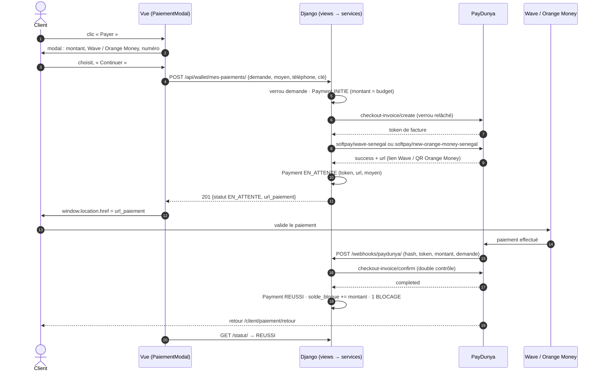
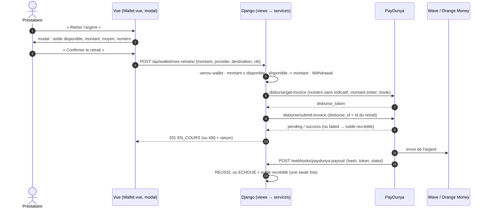

# Paiement et retrait — PayDunya dans MIMOSY

Ce document explique, pour un développeur qui découvre le projet, comment l'argent circule dans
MIMOSY : le **client paie** une prestation (Wave ou Orange Money), l'argent est **bloqué** sur le
wallet du prestataire, puis **libéré** à la fin de la prestation (commission déduite), et le
**prestataire le retire** vers son compte Wave ou Orange Money. Le détail du wallet (libération,
litiges) est dans `docs/wallet.md` ; les questions de soutenance dans `docs/soutenance_paiement.md`.

## État de validation (à lire en premier)

| Élément | Comment c'est vérifié |
|---|---|
| Paiement **Checkout PayDunya en mode test** : facture, page PayDunya sandbox, paiement, **webhook reçu via ngrok**, `REUSSI`, fonds bloqués, une seule `BLOCAGE` | **Testé en réel** le 26/09/2026 (paiement `cb3e9699…`, 10 000 FCFA) |
| Authentification PayDunya, création de facture, vérification du statut (`confirm`) | Testés en réel (mode test) |
| Sécurité du webhook (mauvais hash, paiement inconnu, mal formé, non PayDunya, callback vide) | Testée en réel sur le serveur, via le tunnel public |
| **SoftPay** Wave / Orange Money | **Non testable pour l'instant** : SoftPay n'existe pas en sandbox (`…/sandbox-api/v1/softpay/…` → 404) et, en live, PayDunya répond « Vous devez valider vos informations de KYC avant d'avoir accès au service ». Couvert par des tests automatisés au format de la documentation officielle |
| **Retrait** (API PUSH / déboursement) | **Non testable pour l'instant** : l'API de déboursement répond « LIVE Private Key and Token combination is invalid » avec des clés de test (pas de mode test). Couvert par des tests automatisés |
| Tout le reste (verrous, idempotence, concurrence, montants, numéros) | 129 tests automatisés `apps.wallet`, dont des tests de concurrence réelle sur PostgreSQL |

---

## A. Architecture

```text
Frontend Vue ──► API Django REST ──► services.py ──► PaymentProvider ──► PayDunyaPaymentProvider ──► PayDunyaClient ──► PayDunya
 (modal)          (views.py)         (règles, wallet)  (interface)         (traduction)                 (HTTP brut)        │
                                                                                                                             ▼
Wallet MIMOSY ◄── services.py ◄── views.py (webhook) ◄──────────────── callback / IPN (serveur à serveur) ◄── Wave / Orange Money
```

Chaque couche a un seul rôle :

| Couche | Fichier | Rôle |
|---|---|---|
| Vue (frontend) | `mimosy/src/components/client/PaiementModal.vue`, `views/prestataire/Wallet.vue` | Afficher, faire choisir, rediriger. Jamais de montant envoyé, jamais de clé, jamais de « paiement réussi » décidé ici |
| API | `apps/wallet/views.py` | HTTP : qui a le droit, format des données, code de réponse |
| Métier | `apps/wallet/services.py` | Les règles : montant lu en base, verrous, statuts, wallet, idempotence |
| Interface fournisseur | `apps/wallet/providers/base.py` | Contrat commun + statuts neutres (`REUSSI`, `ECHOUE`, `EN_ATTENTE`, `INCONNU`) |
| Fournisseur PayDunya | `apps/wallet/providers/paydunya.py` | Traduit : facture, SoftPay, déboursement, hash, statuts PayDunya → statuts neutres |
| Fournisseur de développement | `apps/wallet/providers/sandbox.py` | Réussit tout immédiatement, sans Internet (`PAYMENT_PROVIDER=sandbox`) |
| Client HTTP | `apps/wallet/paydunya_client.py` | Appels bruts à PayDunya (httpx), clés dans les en-têtes |

`services.py` ne connaît **que** l'interface : il n'importe jamais `PayDunyaClient` et ne manipule
jamais les chaînes PayDunya (`completed`, `wave-senegal`…). Changer de fournisseur ne toucherait
que `providers/` et `paydunya_client.py`.

### Trois modes de fonctionnement

| `PAYMENT_PROVIDER` | `PAYDUNYA_MODE` | Ce qui se passe au clic « Continuer » |
|---|---|---|
| `sandbox` | — | Paiement `REUSSI` tout de suite, sans PayDunya (développement du reste de l'appli) |
| `paydunya` | `test` | Facture sandbox PayDunya → **page Checkout sandbox** (SoftPay n'existe pas en sandbox). Argent fictif |
| `paydunya` | `live` | Facture live → **SoftPay** : lien Wave, ou QR code / liens Orange Money. Argent réel. Exige un compte KYC validé |

Le choix Wave / Orange Money est enregistré dans tous les cas (`Payment.moyen_paiement`) ; il ne
change l'endpoint appelé qu'en `live`.

## B. Fichiers modifiés (intégration SoftPay + retrait)

| Fichier | Modification | Pourquoi |
|---|---|---|
| `apps/wallet/models.py` + migration `0006` | `Payment.MoyenPaiement` (WAVE / ORANGE_MONEY), champ `moyen_paiement` | Savoir quel SoftPay appeler, et l'afficher / le reprendre |
| `apps/wallet/paydunya_client.py` | `payer_softpay_wave`, `payer_softpay_orange_money`, `disburse_id` au déboursement | Appels documentés par PayDunya |
| `apps/wallet/providers/base.py` | `DetailsPayeur`, `relancer_paiement`, `liens_alternatifs`, champs `identifiant_demande` / `devise` | Contrat commun, sans détail PayDunya |
| `apps/wallet/providers/paydunya.py` | Facture puis SoftPay (live) ou Checkout (test) ; relance sur la même facture ; `failed` à la soumission du retrait ; lecture demande / devise | Traduction PayDunya |
| `apps/wallet/providers/sandbox.py` | Signature `initier_paiement(payment, payeur=None)` | Même contrat |
| `apps/wallet/services.py` | Payeur transmis ; reprise avec un autre moyen ; contrôles demande et devise au callback ; message de refus du retrait | Règles métier |
| `apps/wallet/serializers.py` | `moyen_paiement` + `telephone` obligatoires ; `normaliser_telephone_senegal` ; montant de retrait entier ; `liens_paiement` | Valider avant d'appeler PayDunya |
| `apps/wallet/views.py` | Payeur construit depuis le compte connecté ; 400 + `detail` explicite si PayDunya refuse (paiement ou retrait) | Jamais d'échec muet |
| `apps/wallet/tests.py` | +26 tests (SoftPay, numéros, cohérence du callback, retrait, retraits simultanés) | Couverture |
| `mimosy/src/components/client/PaiementModal.vue` | **Nouveau** : modal de paiement | Choix du moyen dans une popup |
| `mimosy/src/views/client/DetailsDemandes.vue` | « Payer » / « Reprendre le paiement » ouvrent la modal | Parcours demandé |
| `mimosy/src/services/walletService.js` | `payerDemande(id, { moyen_paiement, telephone })` | Nouveau contrat de l'API |
| `mimosy/src/views/prestataire/Wallet.vue` | Flux de retrait existant affiché dans `MModal` ; solde rechargé après un refus | Modal de retrait |

## C. Backend

### Modèles (`apps/wallet/models.py`)

**`Payment`** — une *tentative* de paiement d'une demande acceptée.

| Statut | Sens |
|---|---|
| `INITIE` | Ligne créée par MIMOSY, facture PayDunya pas encore créée |
| `EN_ATTENTE` | Facture (et lien SoftPay) créés ; le client paie ou peut reprendre |
| `REUSSI` | PayDunya a **confirmé** : fonds bloqués sur le wallet |
| `ECHOUE` | Refusé, annulé, expiré, ou jamais de réponse de PayDunya |
| `A_REMBOURSER` | Payé, mais la demande l'était déjà : à rembourser à la main |
| `ANNULE`, `REMBOURSE` | Existants, non utilisés par le flux automatique |

Champs clés : `montant` (copié de `demande.budget`), `reference_externe` (token de la facture
PayDunya), `url_paiement` (lien Wave / page QR Orange Money / checkout), `moyen_paiement`,
`idempotency_key` (unique). Contraintes SQL : un seul paiement `REUSSI` par demande, et un seul
paiement **actif** (`INITIE`, `EN_ATTENTE`, `REUSSI`) par demande.

**`Withdrawal`** — une demande de retrait du prestataire. Statuts **conservés tels quels** :
`EN_ATTENTE` (créé), `EN_COURS` (soumis à PayDunya : c'est le « TRAITEMENT »), `REUSSI`, `ECHOUE`
(solde recrédité), `ANNULE` (non utilisé). Moyens : `WAVE`, `ORANGE_MONEY` (`SANDBOX` réservé aux tests).

### Serializers (`apps/wallet/serializers.py`)

- `InitierPaiementSerializer` : `demande_prestation`, `idempotency_key`, `moyen_paiement`,
  `telephone`. **Aucun montant** : un `montant` envoyé est ignoré.
- `InitierRetraitSerializer` : `montant` (≥ 1 **et entier** : PayDunya refuse les décimales),
  `provider` (WAVE / ORANGE_MONEY), `destination`, `idempotency_key`.
- `normaliser_telephone_senegal()` : accepte `77 123 45 67`, `+221 77…`, `00221…`, `77.123.45.67`
  et renvoie `771234567` (format PayDunya « sans indicatif »). Refuse le reste **avant** tout appel.
- `PaymentSerializer` : lecture seule ; `url_paiement` et `liens_paiement` renvoyés au **seul
  client propriétaire** et seulement tant que le paiement est `EN_ATTENTE`.

### Vues et permissions (`apps/wallet/views.py`)

| Endpoint | Qui | Rôle |
|---|---|---|
| `POST /api/wallet/mes-paiements/` | client connecté | Créer ou reprendre le paiement d'une demande |
| `GET /api/wallet/mes-paiements/` | client connecté | Ses paiements |
| `GET /api/wallet/mes-paiements/<id>/statut/` | client propriétaire | Vérification active auprès de PayDunya |
| `GET/POST /api/wallet/mes-retraits/` | prestataire connecté | Ses retraits / demander un retrait |
| `GET /api/wallet/mon-wallet/` | prestataire connecté | Soldes (bloqué, disponible, gelé) |
| `POST /api/wallet/webhooks/paydunya/` | **public** (serveurs PayDunya) | Callback de paiement |
| `POST /api/wallet/webhooks/paydunya-payout/` | **public** (serveurs PayDunya) | Callback de retrait |

Nom, e-mail du payeur : pris dans le **compte connecté**, jamais dans la requête. Refus PayDunya
(ex. KYC) : réponse **400** avec la raison dans `detail`.

### Services, transactions et verrous (`apps/wallet/services.py`)

`initier_paiement()` en 4 étapes :

1. **Idempotence** : même `idempotency_key` → même paiement.
2. **Hors verrou** : un `INITIE` trop ancien passe `ECHOUE` ; un `EN_ATTENTE` est revérifié auprès
   de PayDunya (payé ? expiré ?) — ce sont des appels HTTP, jamais sous verrou.
3. **Sous verrou** (`select_for_update` sur la demande, dans `transaction.atomic`) : déjà payée →
   refus ; tentative en cours → reprise ; sinon création d'un `INITIE` avec `montant = budget`.
4. **Hors verrou** : provider → facture PayDunya → SoftPay (live) ou checkout (test) → token et URL
   enregistrés.

**Reprise** (`_reprendre_paiement`) : un `EN_ATTENTE` repris avec (éventuellement) un autre moyen
obtient un **nouveau lien SoftPay pour la même facture** — jamais une seconde facture.

`marquer_paiement_reussi()` est le **seul** endroit qui bloque des fonds : verrous demande →
paiement → wallet (toujours dans cet ordre), statut relu sous verrou, une seule `BLOCAGE`.

`initier_retrait()` : sous verrou du wallet, vérifie `montant ≤ solde_disponible`, **déduit
immédiatement** (réservation) et crée le `Withdrawal`, puis appelle PayDunya hors verrou. En cas
d'échec (immédiat ou par callback), `_restaurer_solde_apres_echec_retrait()` recrédite le montant
une seule fois (retrait verrouillé et statut relu) avec une transaction `REMBOURSEMENT`.

### Webhook (`traiter_callback_paiement_paydunya`)

Contrôles, dans l'ordre : **hash** (SHA-512 de la Master Key, `hmac.compare_digest`) → paiement
retrouvé par `custom_data.payment_id` → **token** (`invoice.token`) = `reference_externe` →
**montant** = `Payment.montant` → **demande** (`custom_data.demande_prestation_id`) = celle du
paiement → **devise** XOF si PayDunya l'indique → pour un succès, **re-vérification** auprès de
PayDunya (`checkout-invoice/confirm`) → `marquer_paiement_reussi()`. Toujours 200 (sinon PayDunya
renverrait le même message en boucle). Le webhook de retrait applique la même discipline (hash,
token, montant).

### Idempotence et erreurs

| Situation | Effet |
|---|---|
| Même clé rejouée / en même temps | Même paiement ; `IntegrityError` rattrapée, pas de 500 |
| Callback reçu deux fois, ou en même temps que la vérification | Un seul blocage |
| Deux factures payées pour la même demande | La seconde → `A_REMBOURSER`, aucun effet sur le wallet |
| Callback de retrait d'échec reçu deux fois | Un seul recrédit |
| PayDunya injoignable | Paiement / retrait `ECHOUE`, message explicite, solde intact ou recrédité |

## D. Frontend

- **`PaiementModal.vue`** : montant (lecture seule, « calculé par MIMOSY »), choix Wave / Orange
  Money (boutons radio), numéro pré-rempli avec le téléphone du compte, `Continuer` / `Fermer`.
  Chargement : « Préparation du paiement… », modal non fermable pendant l'envoi. Succès : **vraie
  redirection** (`window.location.href`) vers l'URL renvoyée par le backend. Erreur : message du
  backend (souvent celui de PayDunya) affiché dans la modal.
- **`DetailsDemandes.vue`** : « Payer » ouvre la modal ; « Reprendre le paiement » l'ouvre avec le
  moyen déjà choisi ; « Vérifier mon paiement » interroge `/statut/`.
- **`PaiementRetour.vue`** : n'affiche « Paiement réussi » que si le **backend** répond `REUSSI`.
- **`Wallet.vue`** (prestataire) : « Retirer l'argent » ouvre la modal « Retirer mon argent »
  (solde disponible lu sur le backend, montant, Wave / Orange Money, numéro, récapitulatif,
  résultat). Après un refus, le solde est **rechargé depuis le backend**.

## E. PayDunya en quelques mots

| Terme | Signification |
|---|---|
| **Master Key** | Identifie le compte marchand. Sert aussi à signer les callbacks (le `hash` = SHA-512 de la Master Key). Secrète |
| **Private Key** | Clé privée de l'application (`test_private_…` en test, `live_private_…` en live). Secrète |
| **Token** | Jeton de l'application PayDunya (en-tête `PAYDUNYA-TOKEN`). Secret. À ne pas confondre avec le token **de facture** |
| **Clé publique** | `test_public_…` : **non utilisée** par MIMOSY (erreur fréquente : la coller à la place de la Master Key) |
| **Invoice (facture)** | Demande de paiement créée par `checkout-invoice/create` ; son **token** identifie le paiement chez PayDunya |
| **Payment** | Notre objet MIMOSY qui suit une tentative de paiement |
| **Checkout** | Page de paiement hébergée par PayDunya (`response_text` de la facture) |
| **SoftPay** | Payer une facture directement par un opérateur (Wave, Orange Money…) sans la page Checkout |
| **Webhook / IPN / callback** | Requête `POST` des serveurs PayDunya vers MIMOSY quand un paiement ou un retrait est conclu |
| **API PUSH (déboursement)** | Envoi d'argent du compte MIMOSY vers le Wave / Orange Money d'un prestataire |
| **Sandbox / test** | Argent fictif (`sandbox-api`) : checkout seulement, ni SoftPay ni déboursement |
| **Production / live** | Argent réel ; exige un compte marchand PayDunya vérifié (**KYC**) |

## F. Sécurité

- **Les clés restent sur le serveur** (`back_Mimosy/.env.docker`, ignoré par Git). Dans le
  navigateur, n'importe qui peut lire le code JavaScript : une clé envoyée au frontend
  permettrait à un inconnu de créer des factures ou de **déclencher des retraits** au nom de MIMOSY.
- **Le frontend ne déclare jamais `Payment = REUSSI`** : il ne sait rien de ce qui s'est passé chez
  Wave ou Orange Money, et tout ce qu'il envoie peut être falsifié. Seul le backend, sur un
  callback **signé** et **re-vérifié** auprès de PayDunya, passe un paiement à `REUSSI`.
- Montant toujours lu en base ; numéro validé avant d'appeler PayDunya ; URL de paiement en
  `https://` uniquement ; `url_paiement` visible du seul propriétaire ; aucun secret dans les logs
  (vérifié : 0 occurrence).

## G. Flux complets

### Paiement (live : SoftPay)



En **mode test**, les étapes 8-10 sont remplacées par la page Checkout sandbox de la même facture.
Le retour automatique vers `/client/paiement/retour` est confirmé pour le Checkout ; pour SoftPay,
il dépend de l'opérateur (non vérifiable sans compte live) — sinon le client revient sur sa demande
et « Vérifier mon paiement » interroge PayDunya.

### Retrait (API PUSH)



## H. Commission et libération

Commission MIMOSY : **10 % du montant payé** (`COMMISSION_TAUX=0.10`), prélevée uniquement quand la
prestation passe `TERMINEE` par l'API (`/terminer/`), qui appelle `liberer_fonds_pour_prestation()` :
`solde_bloque -= montant`, `solde_disponible += montant − commission`, transactions `COMMISSION` et
`LIBERATION`. (La valeur « 2 000 FCFA fixes » a été évoquée mais n'est **pas** la règle du code :
décision du 26/09/2026 de conserver 10 %.) Détail et litiges : `docs/wallet.md`.

## I. Variables d'environnement

Dans `back_Mimosy/.env.docker` (Docker) — **ignoré par Git** ; modèles versionnés : `*.example`.

| Variable | Rôle | Test local | Production |
|---|---|---|---|
| `PAYMENT_PROVIDER` | `sandbox` ou `paydunya` | `paydunya` | `paydunya` |
| `PAYDUNYA_MODE` | `test` (checkout sandbox) ou `live` (SoftPay, retraits) | `test` | `live` |
| `PAYDUNYA_MASTER_KEY`, `PAYDUNYA_PRIVATE_KEY`, `PAYDUNYA_TOKEN` | clés du compte | clés de test | clés live |
| `PAYDUNYA_CALLBACK_URL` | URL publique du webhook de paiement | URL ngrok | domaine HTTPS |
| `PAYDUNYA_PAYOUT_CALLBACK_URL` | URL publique du webhook de retrait | URL ngrok | domaine HTTPS |
| `ALLOWED_HOSTS` | domaines acceptés | + domaine ngrok | domaine |
| `FRONTEND_BASE_URL` | retour après paiement | `http://localhost:5173` | domaine |
| `PAYMENT_INITIE_TIMEOUT_MINUTES` | abandon d'un `INITIE` | 10 | 10 |
| `COMMISSION_TAUX` | commission à la libération | 0.10 | 0.10 |

Après modification : `docker compose up -d backend` (un `restart` ne relit pas `.env.docker`).

Vérifier sans afficher de secret :

```bash
docker compose exec backend python manage.py shell -c "
from django.conf import settings as s
print(s.PAYMENT_PROVIDER, s.PAYDUNYA_MODE, bool(s.PAYDUNYA_MASTER_KEY), bool(s.PAYDUNYA_PRIVATE_KEY),
      bool(s.PAYDUNYA_TOKEN), s.PAYDUNYA_CALLBACK_URL, s.ALLOWED_HOSTS)"
```

Vérifier les clés sans rien créer : `PayDunyaClient().confirmer_facture_paiement('test_inexistant')`
→ `4004 No Transaction Found.` = clés acceptées ; `1001 Invalid Masterkey Specified` = refusées.

## J. Développement local avec ngrok

Le navigateur (redirection vers PayDunya, retour vers `localhost:5173`) fonctionne sans rien
faire. Les **callbacks** partent des serveurs PayDunya et ne peuvent pas joindre `localhost` :

```bash
ngrok config add-authtoken <authtoken du tableau de bord ngrok>   # une fois, sans sudo
ngrok http 8000                                                    # → https://<id>.ngrok-free.dev
```

Puis dans `.env.docker` : `PAYDUNYA_CALLBACK_URL=https://<id>.ngrok-free.dev/api/wallet/webhooks/paydunya/`
(et `…/paydunya-payout/`), domaine ajouté à `ALLOWED_HOSTS`, `docker compose up -d backend`.
Contrôle : `curl -X POST https://<id>…/api/wallet/webhooks/paydunya/` → 200 (« hash invalide »),
visible dans http://127.0.0.1:4040. Le domaine gratuit change à chaque relance de ngrok.

## K. Passage Sandbox → production

1. Faire **valider le KYC** du compte marchand PayDunya (sinon SoftPay répond 1001 KYC).
2. Récupérer les clés **live** ; sur le serveur uniquement : `PAYDUNYA_MODE=live`, clés live,
   `DEBUG=False` (modèle : `.env.docker.prod.example`).
3. Callbacks et `ALLOWED_HOSTS` / `FRONTEND_BASE_URL` sur le domaine HTTPS de production.
4. Approvisionner le **solde marchand** PayDunya (les retraits partent de ce solde).
5. Premier paiement réel de petit montant (Wave puis Orange Money), premier retrait de petit
   montant ; vérifier callback, `REUSSI`, wallet, transactions.

## L. Dépannage

| Symptôme | Cause probable | Que faire |
|---|---|---|
| `1001 Invalid Masterkey Specified` | Master Key fausse — cas réel : **clé publique** collée à la place | Copier la Master Key, `docker compose up -d backend` |
| Modal : « Vous devez valider vos informations de KYC… » | SoftPay en `live` sans compte vérifié | Valider le KYC, ou repasser `PAYDUNYA_MODE=test` |
| Retrait : « LIVE Private Key and Token combination is invalid » | Déboursement avec des clés de test | Retraits uniquement en live ; solde recrédité automatiquement |
| Paiement immédiatement `REUSSI`, pas de redirection | `PAYMENT_PROVIDER=sandbox` | Vérifier `.env.docker` |
| Clés modifiées, aucun effet | Conteneur non recréé | `docker compose up -d backend` |
| Aucun callback reçu | ngrok arrêté, ancienne URL, `PAYDUNYA_CALLBACK_URL` vide | http://127.0.0.1:4040, logs backend |
| Callback en 400 | Domaine ngrok absent d'`ALLOWED_HOSTS` | Ajouter le domaine |
| `ERR_NGROK_105` | Authtoken ngrok = valeur d'exemple | `ngrok config add-authtoken <vrai token>` (sans sudo) |
| « Callback PayDunya rejeté : hash invalide » | Master Key différente de celle du compte | Clés et mode |
| « montant reçu … différent » / « token absent… » / « autre demande » / « devise inattendue » | Callback d'une autre facture ou modifié | Ne pas contourner : c'est la protection |
| « callback de succès non confirmé par PayDunya » | PayDunya pas encore `completed` au moment du callback | « Vérifier mon paiement » plus tard |
| Paiement resté `EN_ATTENTE` (PENDING) | Client pas allé au bout, ou callback perdu | « Reprendre le paiement » (même facture) ou « Vérifier » ; la facture expire (`cancelled`) après 24 h |
| Paiement `ECHOUE` (FAILED) | Refus opérateur, annulation, expiration | Nouveau clic « Payer » : nouvelle tentative |
| Paiement `A_REMBOURSER` | Le client a payé deux factures | Rembourser depuis le tableau de bord PayDunya |
| Retrait refusé « Numéro invalide » | Pas 9 chiffres commençant par 70/75/76/77/78 | Corriger le numéro |
| Retrait refusé « nombre entier de FCFA » | Montant avec centimes | Montant entier |
| Demande `TERMINEE` mais fonds toujours bloqués | Statut changé hors de l'API (ex. admin), `/terminer/` jamais appelé | Terminer par le parcours normal ; la libération n'a lieu que là |

Journaux utiles (`docker compose logs -f backend`, logger `apps.wallet`, jamais de secret) :

```text
INFO … Paiement <id> créé (demande …, montant …, fournisseur PAYDUNYA, moyen WAVE).
INFO … Lien SoftPay WAVE créé pour le paiement <id> (liens supplémentaires : 0).
WARNING … SoftPay WAVE refusé pour le paiement <id> : response_code=1001, message=…KYC…
INFO … Callback PayDunya authentifié pour le paiement <id> : statut annoncé=REUSSI …
INFO … Callback PayDunya accepté : paiement <id> → statut REUSSI
```
